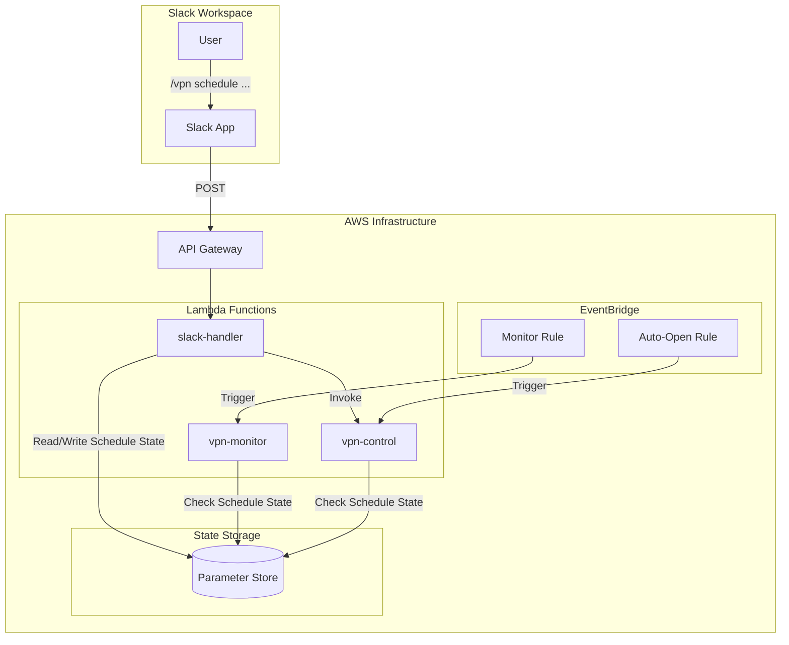

# Design Document: Auto-Schedule Slack Commands

## Overview

This design document describes the implementation of Slack commands for managing VPN auto-scheduling functionality. The feature extends the existing Slack command infrastructure to allow users to enable, disable, and check the status of automatic VPN open/close schedules through intuitive slash commands.

The implementation follows the existing patterns established in the codebase, leveraging the Lambda-based architecture with Parameter Store for state persistence and the shared utilities layer for common functionality.

## Architecture



## Components and Interfaces

### 1. Schedule State Manager (New Module)

A new shared module `scheduleManager.ts` will be added to handle schedule state operations.

```typescript
// lambda/shared/scheduleManager.ts

export interface ScheduleState {
  autoOpen: {
    enabled: boolean;
    lastModified: string;      // ISO 8601 timestamp
    modifiedBy: string;        // Slack username
    expiresAt?: string;        // ISO 8601 timestamp (optional)
  };
  autoClose: {
    enabled: boolean;
    lastModified: string;
    modifiedBy: string;
    expiresAt?: string;
  };
}

export interface ScheduleConfig {
  autoOpenTime: string;        // "09:30" in configured timezone
  autoOpenDays: number[];      // [1,2,3,4,5] for Mon-Fri
  autoCloseIdleMinutes: number;
  businessHoursStart: string;  // "09:30"
  businessHoursEnd: string;    // "17:30"
  timezone: string;            // "Asia/Taipei"
}

// Read current schedule state
export async function readScheduleState(environment: string): Promise<ScheduleState>;

// Write schedule state
export async function writeScheduleState(
  environment: string, 
  state: ScheduleState
): Promise<void>;

// Check if auto-open is currently enabled (considering expiration)
export async function isAutoOpenEnabled(environment: string): Promise<boolean>;

// Check if auto-close is currently enabled (considering expiration)
export async function isAutoCloseEnabled(environment: string): Promise<boolean>;

// Enable schedule with optional expiration
export async function enableSchedule(
  environment: string,
  scheduleType: 'autoOpen' | 'autoClose' | 'both',
  modifiedBy: string
): Promise<ScheduleState>;

// Disable schedule with optional duration
export async function disableSchedule(
  environment: string,
  scheduleType: 'autoOpen' | 'autoClose' | 'both',
  modifiedBy: string,
  duration?: string  // e.g., "2h", "24h", "7d"
): Promise<ScheduleState>;

// Get schedule configuration
export async function getScheduleConfig(environment: string): Promise<ScheduleConfig>;

// Calculate next scheduled open time
export function getNextScheduledOpenTime(config: ScheduleConfig): Date;
```

### 2. Slack Command Parser Extension

Extend `parseSlackCommand` in `slack.ts` to handle schedule commands.

```typescript
// New command patterns to support:
// /vpn schedule on <environment>
// /vpn schedule off <environment> [duration]
// /vpn schedule check <environment>
// /vpn schedule open on|off <environment>
// /vpn schedule close on|off <environment>
// /vpn schedule help

export interface ScheduleCommandRequest extends VpnCommandRequest {
  action: 'schedule-on' | 'schedule-off' | 'schedule-check' | 
          'schedule-open-on' | 'schedule-open-off' |
          'schedule-close-on' | 'schedule-close-off' |
          'schedule-help';
  duration?: string;  // For schedule-off with duration
}
```

### 3. VPN Types Extension

Update `types.ts` to include schedule-related types.

```typescript
// Add to VpnCommandRequest action union
export interface VpnCommandRequest {
  action: 'open' | 'close' | 'check' | 
          'admin-noclose' | 'admin-autoclose' | 'admin-cooldown' | 'admin-force-close' |
          'cost-savings' | 'cost-analysis' |
          'schedule-on' | 'schedule-off' | 'schedule-check' |
          'schedule-open-on' | 'schedule-open-off' |
          'schedule-close-on' | 'schedule-close-off' |
          'schedule-help' |
          'help';
  environment: 'staging' | 'production' | string;
  user: string;
  requestId: string;
  helpMessage?: string;
  duration?: string;  // For schedule commands with duration
}

// Schedule status response data
export interface ScheduleStatusData {
  autoOpen: {
    enabled: boolean;
    nextScheduledTime?: string;
    disabledUntil?: string;
  };
  autoClose: {
    enabled: boolean;
    idleTimeoutMinutes: number;
    disabledUntil?: string;
  };
  businessHoursProtection: {
    enabled: boolean;
    start: string;
    end: string;
    timezone: string;
  };
  lastModified: string;
  modifiedBy: string;
}
```

### 4. Slack Handler Integration

The slack-handler will route schedule commands to appropriate handlers.

```typescript
// In slack-handler/index.ts

// Handle schedule commands
if (vpnCommand.action.startsWith('schedule-')) {
  response = await handleScheduleCommand(vpnCommand, logger);
}

async function handleScheduleCommand(
  command: VpnCommandRequest, 
  logger: any
): Promise<VpnCommandResponse> {
  const scheduleManager = await import('/opt/nodejs/scheduleManager');
  
  switch (command.action) {
    case 'schedule-on':
      return await scheduleManager.enableSchedule(
        command.environment, 'both', command.user
      );
    case 'schedule-off':
      return await scheduleManager.disableSchedule(
        command.environment, 'both', command.user, command.duration
      );
    case 'schedule-check':
      return await scheduleManager.getScheduleStatus(command.environment);
    // ... other cases
  }
}
```

### 5. VPN Monitor Integration

Update vpn-monitor to check schedule state before operations.

```typescript
// In vpn-monitor/index.ts

// Before auto-close logic
const isAutoCloseEnabled = await scheduleManager.isAutoCloseEnabled(ENVIRONMENT);
if (!isAutoCloseEnabled) {
  logger.info('Auto-close schedule is disabled, skipping idle check', {
    environment: ENVIRONMENT,
    reason: 'schedule_disabled'
  });
  await publishMetric('ScheduleDisabledSkips', 1);
  return;
}
```

## Data Models

### Parameter Store Schema

Schedule state will be stored in Parameter Store with the following structure:

```
/vpn/automation/schedule/{environment}/state
```

JSON structure:
```json
{
  "autoOpen": {
    "enabled": true,
    "lastModified": "2026-01-03T10:30:00Z",
    "modifiedBy": "admin_user",
    "expiresAt": null
  },
  "autoClose": {
    "enabled": true,
    "lastModified": "2026-01-03T10:30:00Z",
    "modifiedBy": "admin_user",
    "expiresAt": "2026-01-04T10:30:00Z"
  }
}
```

Schedule configuration (read-only, set during deployment):
```
/vpn/automation/schedule/{environment}/config
```

```json
{
  "autoOpenTime": "09:30",
  "autoOpenDays": [1, 2, 3, 4, 5],
  "autoCloseIdleMinutes": 100,
  "businessHoursStart": "09:30",
  "businessHoursEnd": "17:30",
  "timezone": "Asia/Taipei"
}
```

## Correctness Properties

*A property is a characteristic or behavior that should hold true across all valid executions of a system-essentially, a formal statement about what the system should do. Properties serve as the bridge between human-readable specifications and machine-verifiable correctness guarantees.*


### Property 1: Schedule State Mutation Correctness

*For any* valid schedule command (enable/disable for autoOpen, autoClose, or both), executing the command SHALL result in the schedule state reflecting exactly the requested change, with the non-targeted schedule remaining unchanged when granular commands are used.

**Validates: Requirements 1.1, 2.1, 4.1, 4.2, 4.3, 4.4, 4.5**

### Property 2: State Persistence Round-Trip

*For any* valid ScheduleState object, writing it to Parameter Store and then reading it back SHALL produce an equivalent object with all fields preserved (enabled status, lastModified timestamp, modifiedBy user, and expiresAt if present).

**Validates: Requirements 1.2, 2.4, 5.3, 5.4**

### Property 3: Duration Parsing and Expiration

*For any* valid duration string (e.g., "2h", "24h", "7d"), disabling a schedule with that duration SHALL result in an expiresAt timestamp that is exactly the specified duration from the current time, and checking schedule enabled status after expiration SHALL return true.

**Validates: Requirements 2.2, 2.3**

### Property 4: Authorization Enforcement

*For any* user not in the authorized list for a given environment, attempting any schedule command SHALL return an access denied error without modifying schedule state.

**Validates: Requirements 1.4, 2.6**

### Property 5: Status Response Completeness

*For any* schedule check command, the response SHALL contain all required fields: autoOpen enabled state with next scheduled time, autoClose enabled state with idle timeout, business hours protection status, and remaining disable time if applicable.

**Validates: Requirements 3.1, 3.2, 3.3, 3.4, 3.5**

### Property 6: Bilingual Response Format

*For any* schedule command response (enable, disable, check, help), the formatted Slack message SHALL contain both English and Traditional Chinese text for all user-facing content.

**Validates: Requirements 3.6, 7.4**

### Property 7: Monitor Respects Schedule State

*For any* VPN monitor execution, when auto-open schedule is disabled the monitor SHALL skip morning open operations, and when auto-close schedule is disabled the monitor SHALL skip idle-based close operations, with appropriate logging.

**Validates: Requirements 6.1, 6.2, 6.3, 6.4**

### Property 8: Help Documentation Completeness

*For any* help command (general or schedule-specific), the response SHALL include command syntax, usage examples, and available options for all schedule commands.

**Validates: Requirements 7.1, 7.2, 7.3**

## Error Handling

### Command Parsing Errors

| Error Condition | Response |
|----------------|----------|
| Invalid schedule action | "Invalid schedule action. Use: on, off, check, open, close, or help" |
| Missing environment | "Environment required. Use: staging or production" |
| Invalid environment | "Invalid environment. Must be: staging or production" |
| Invalid duration format | "Invalid duration format. Use: Nh (hours), Nd (days). Examples: 2h, 24h, 7d" |

### Authorization Errors

| Error Condition | Response |
|----------------|----------|
| Unauthorized user | "❌ Access denied: User '{username}' is not authorized for {environment} schedule management" |
| Production access denied | "❌ Production schedule management requires elevated permissions" |

### State Management Errors

| Error Condition | Response |
|----------------|----------|
| Parameter Store read failure | "Failed to read schedule state. Please try again or contact administrator" |
| Parameter Store write failure | "Failed to save schedule state. Please try again or contact administrator" |
| Invalid state format | Log error, return default enabled state, alert administrators |

### Error Response Format

All error responses follow the existing Slack response format:

```typescript
{
  response_type: 'ephemeral',
  text: '❌ Schedule command failed | 排程指令失敗',
  attachments: [{
    color: 'danger',
    fields: [{
      title: 'Error | 錯誤',
      value: errorMessage,
      short: false
    }, {
      title: 'Usage | 使用方式',
      value: '/vpn schedule <on|off|check> <environment>',
      short: false
    }]
  }]
}
```

## Testing Strategy

### Unit Tests

Unit tests will cover:
- Duration string parsing (valid and invalid formats)
- Schedule state JSON serialization/deserialization
- Next scheduled open time calculation
- Expiration checking logic
- Command parsing for all schedule command variants
- Authorization checking

### Property-Based Tests

Property-based tests will use `fast-check` library (already used in the project) with minimum 100 iterations per property:

1. **Schedule State Mutation** - Generate random schedule states and commands, verify state changes correctly
2. **State Persistence Round-Trip** - Generate random ScheduleState objects, verify serialization round-trip
3. **Duration Parsing** - Generate random valid duration strings, verify correct expiration calculation
4. **Authorization** - Generate random user/environment combinations, verify authorization enforcement

### Integration Tests

Integration tests will verify:
- End-to-end Slack command flow for schedule commands
- Parameter Store integration for state persistence
- VPN Monitor behavior with different schedule states
- Cross-environment schedule isolation

### Test Configuration

```typescript
// Property test configuration
const propertyTestConfig = {
  numRuns: 100,
  verbose: true,
  seed: Date.now()
};

// Test tag format
// Feature: auto-schedule-slack-commands, Property N: <property_text>
```
