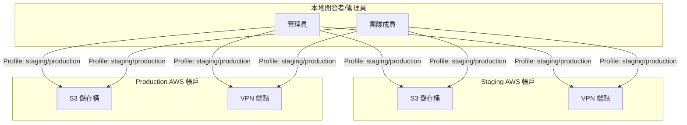
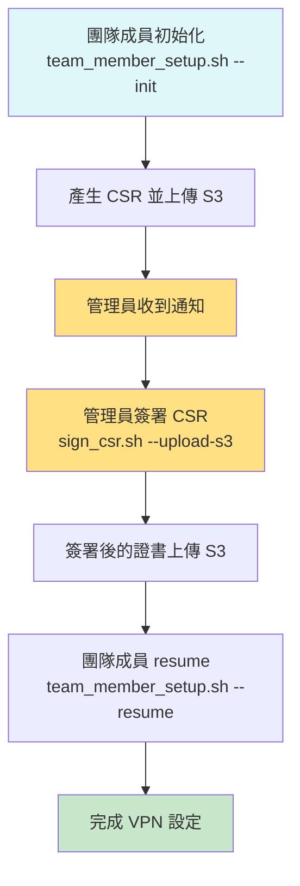
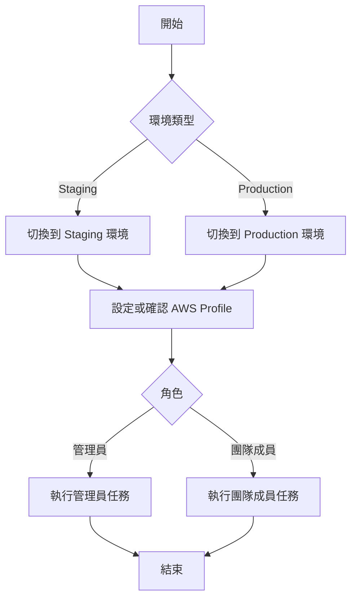

# 雙 AWS Profile 設定圖文指南

> 本指南將以圖文並茂的方式，帶您快速理解與完成雙 AWS 帳戶 Profile 管理系統的設定，讓您安全、直覺地在 Staging 與 Production 環境間切換與操作。

---

## 目錄
1. [架構總覽（圖解）](#架構總覽圖解)
2. [前置要求](#前置要求)
3. [Profile 設定與驗證](#profile-設定與驗證)
4. [環境配置與偏好](#環境配置與偏好)
5. [管理員與團隊成員操作流程（圖解）](#管理員與團隊成員操作流程圖解)
6. [日常操作與故障排除](#日常操作與故障排除)
7. [附錄：範例設定與常用指令](#附錄範例設定與常用指令)

---

## 架構總覽（圖解）

下圖說明雙 AWS Profile 管理的核心架構與資料流：



- **Staging/Production AWS 帳戶**：各自擁有獨立的 S3、VPN 端點與 Profile。
- **管理員/團隊成員**：透過本地工具，根據環境自動選擇正確的 AWS Profile，並與對應資源互動。
- **Profile 隔離**：每個環境的操作都會自動驗證與隔離，避免誤用。

---

## 前置要求

### 系統要求
- **作業系統**: macOS (已測試)
- **必要工具**:
  - AWS CLI v2
  - jq (JSON 處理器)
  - OpenSSL
  - Git

### 權限要求
- 兩個 AWS 帳戶的管理員權限 (Staging & Production)
- IAM 權限創建和管理：
  - VPN 端點
  - S3 存儲桶
  - ACM 證書
  - IAM 用戶和政策

## Profile 設定與驗證

### 1. 設定 AWS Profiles

建議的 Profile 命名約定：

```bash
# Staging 環境
aws configure --profile staging
# 或
aws configure --profile company-staging
aws configure --profile dev-staging

# Production 環境  
aws configure --profile production
# 或
aws configure --profile company-production  
aws configure --profile prod
```

### 2. 驗證 Profile 設定

```bash
# 檢查可用的 profiles
aws configure list-profiles

# 測試每個 profile
aws sts get-caller-identity --profile staging
aws sts get-caller-identity --profile production
```

### 3. Profile 最佳實務

**命名約定建議**:
- 包含環境名稱: `staging`, `production`, `prod`
- 可選公司前綴: `company-staging`, `myorg-prod`
- 避免模糊命名: `test`, `dev` (除非明確對應 staging)

**安全設定**:
```bash
# 設定 region
aws configure set region us-east-1 --profile staging
aws configure set region us-east-1 --profile production

# 設定輸出格式
aws configure set output json --profile staging
aws configure set output json --profile production
```

## 環境配置與偏好

### 1. 更新環境配置檔案

#### Staging 環境 (`configs/staging/staging.env`)

```bash
# === AWS Profile 設定 ===
# 環境特定 AWS Profile (可選，留空使用自動檢測)
ENV_AWS_PROFILE=""

# 建議的 Profile 名稱 (用於自動推薦)
SUGGESTED_PROFILES="staging,company-staging,dev-staging"

# === 帳戶驗證 ===
# Staging AWS 帳戶 ID (12位數字)
STAGING_ACCOUNT_ID="123456789012"

# === S3 配置 (零接觸工作流程) ===
# S3 存儲桶名稱 (所有環境使用統一名稱)
# 注意：現已統一使用 "vpn-csr-exchange" 作為所有環境的 S3 存儲桶名稱

# === VPN 設定 ===
ENDPOINT_ID="cvpn-endpoint-staging123"
AWS_REGION="us-east-1"

# ... 其他現有配置 ...
```

#### Production 環境 (`configs/production/production.env`)

```bash
# === AWS Profile 設定 ===
# 環境特定 AWS Profile (可選，留空使用自動檢測)
ENV_AWS_PROFILE=""

# 建議的 Profile 名稱 (用於自動推薦)
SUGGESTED_PROFILES="production,company-production,prod"

# === 帳戶驗證 ===  
# Production AWS 帳戶 ID (12位數字)
PRODUCTION_ACCOUNT_ID="987654321098"

# === S3 配置 (零接觸工作流程) ===
# S3 存儲桶名稱 (所有環境使用統一名稱)
# 注意：現已統一使用 "vpn-csr-exchange" 作為所有環境的 S3 存儲桶名稱

# === VPN 設定 ===
ENDPOINT_ID="cvpn-endpoint-prod456"
AWS_REGION="us-east-1"

# ... 其他現有配置 ...
```

### 2. 設定 Profile 偏好

如果您有固定的 profile 偏好，可以直接設定：

```bash
# 設定 staging 環境使用特定 profile
./vpn_env.sh switch staging
./admin-tools/aws_vpn_admin.sh --set-profile company-staging

# 設定 production 環境使用特定 profile  
./vpn_env.sh switch production
./admin-tools/aws_vpn_admin.sh --set-profile company-production
```

## 管理員與團隊成員操作流程（圖解）

下圖說明零接觸工作流程的主要步驟與互動：



- **自動化流程**：團隊成員與管理員皆可透過腳本自動完成大部分操作，減少人為錯誤。
- **S3 作為交換平台**：CSR 與簽署後證書皆透過 S3 交換，確保安全與可追蹤性。

---

以下說明管理員與團隊成員在雙 AWS Profile 管理系統中的操作流程：



- **開始**：所有操作從這裡開始。
- **環境類型**：根據要操作的環境類型（Staging 或 Production）進行切換。
- **設定或確認 AWS Profile**：確保使用正確的 AWS Profile 以避免誤操作。
- **角色**：根據身份角色（管理員或團隊成員）執行相應的任務。
- **結束**：所有操作結束。

---

## 日常操作與故障排除

### 1. 環境檢查和狀態

```bash
# 檢查當前環境和 AWS profile 狀態
./vpn_env.sh status

# 詳細的 profile 資訊
./admin-tools/aws_vpn_admin.sh --profile-status
```

### 2. 環境切換

```bash
# 切換環境 (自動處理 profile)
./vpn_env.sh switch staging
./vpn_env.sh switch production

# 使用環境選擇器 (互動式)
./enhanced_env_selector.sh
```

### 3. Profile 管理

```bash
# 檢視當前 profile 設定
./admin-tools/aws_vpn_admin.sh --show-profile

# 更換 profile
./admin-tools/aws_vpn_admin.sh --set-profile new-profile-name

# 重設為自動偵測
./admin-tools/aws_vpn_admin.sh --reset-profile
```

### 4. 管理操作

```bash
# 所有管理工具現在都支援自動 profile 檢測
./admin-tools/aws_vpn_admin.sh       # 主要管理控制台
./admin-tools/sign_csr.sh user.csr   # 使用當前環境的 profile
./admin-tools/process_csr_batch.sh monitor  # 監控模式
```

## 附錄：範例設定與常用指令

### A. 環境配置範本

#### Staging 環境完整配置
```bash
# configs/staging/staging.env

# === 基本環境設定 ===
ENVIRONMENT_NAME="staging"
ENVIRONMENT_TYPE="staging"

# === AWS Profile 設定 ===
ENV_AWS_PROFILE=""
SUGGESTED_PROFILES="staging,company-staging,dev-staging"

# === 帳戶驗證 ===
STAGING_ACCOUNT_ID="123456789012"

# === S3 配置 ===
# 注意：所有環境統一使用 "vpn-csr-exchange" 作為 S3 存儲桶名稱

# === VPN 設定 ===
ENDPOINT_ID="cvpn-endpoint-staging123"
AWS_REGION="us-east-1"
VPN_CIDR="10.0.0.0/16"

# === 安全設定 ===
REQUIRE_CONFIRMATION="false"
LOG_LEVEL="INFO"
```

#### Production 環境完整配置
```bash
# configs/production/production.env

# === 基本環境設定 ===
ENVIRONMENT_NAME="production"
ENVIRONMENT_TYPE="production"

# === AWS Profile 設定 ===
ENV_AWS_PROFILE=""
SUGGESTED_PROFILES="production,company-production,prod"

# === 帳戶驗證 ===
PRODUCTION_ACCOUNT_ID="987654321098"

# === S3 配置 ===
# 注意：所有環境統一使用 "vpn-csr-exchange" 作為 S3 存儲桶名稱

# === VPN 設定 ===
ENDPOINT_ID="cvpn-endpoint-prod456"
AWS_REGION="us-east-1"
VPN_CIDR="10.1.0.0/16"

# === 安全設定 ===
REQUIRE_CONFIRMATION="true"
LOG_LEVEL="WARN"
```

### B. 快速參考命令

```bash
# 環境操作
./vpn_env.sh status                    # 檢查狀態
./vpn_env.sh switch <env>             # 切換環境

# Profile 管理
./admin-tools/aws_vpn_admin.sh --show-profile    # 顯示當前 profile
./admin-tools/aws_vpn_admin.sh --set-profile     # 設定 profile

# 零接觸工作流程
./team_member_setup.sh --init         # 初始化
./team_member_setup.sh --resume       # 完成設定
./admin-tools/sign_csr.sh --upload-s3 # 簽署並上傳

# 管理操作
./admin-tools/setup_csr_s3_bucket.sh --publish-assets  # 建立 S3
./admin-tools/publish_endpoints.sh                     # 發布端點資訊
./admin-tools/process_csr_batch.sh monitor            # 批次監控
```

---

### 團隊成員操作詳細步驟

1. **初始化與產生 CSR**
   - 執行 `./team_member_setup.sh --init`。
   - 腳本會自動偵測環境、產生私鑰與 CSR（證書簽署請求）。
   - CSR 會自動上傳到 S3（如啟用零接觸模式），或提示手動提供給管理員。
   - 畫面會顯示「請通知管理員」與等待簽署的指示。

2. **等待管理員簽署**
   - 此時流程暫停，需等待管理員完成簽署。
   - 可與管理員溝通，確認 CSR 已上傳。

3. **下載簽署後的證書並完成設定**
   - 當管理員簽署完成並上傳證書後，執行 `./team_member_setup.sh --resume`。
   - 腳本會自動下載簽署後的證書，並驗證與本地私鑰匹配。
   - 完成 VPN 設定與憑證導入。

4. **（選用）傳統模式**
   - 若無法使用 S3，則手動將 CSR 提供給管理員，並手動取得簽署證書後執行 `--resume-cert`。

---

### 管理員操作詳細步驟

1. **監控或下載新 CSR**
   - 可定期執行 `./admin-tools/process_csr_batch.sh download -e <env>` 下載 S3 上的新 CSR。
   - 或執行 `./admin-tools/process_csr_batch.sh monitor -e <env>` 進行自動監控，發現新 CSR 會即時顯示。

2. **簽署 CSR**
   - 使用 `./admin-tools/sign_csr.sh --upload-s3 -e <env> <csr-file>` 單筆簽署並自動上傳。
   - 或用 `./admin-tools/process_csr_batch.sh process -e <env>` 批次簽署所有待處理 CSR。
   - 簽署後的證書會自動上傳回 S3，供團隊成員下載。

3. **通知團隊成員**
   - 目前系統僅於終端顯示「證書已簽署」與 S3 路徑，需人工通知團隊成員可執行 `--resume` 下載證書。
   - 可考慮整合 Slack/email 通知（需另行開發）。

4. **日誌與審計**
   - 所有簽署、上傳、下載操作皆會記錄於 logs 目錄，方便日後稽核。

---

### S3 CSR 交換桶設置詳細說明（管理員）

1. **建立 S3 存儲桶**
   - 執行：
     ```bash
     ./admin-tools/setup_csr_s3_bucket.sh --publish-assets --create-users
     ```
   - 預設會建立 `vpn-csr-exchange` 存儲桶（可用 `-b` 指定名稱），並自動啟用版本控制與 AES256 加密。

2. **設置存儲桶政策**
   - 自動設置嚴格的 S3 Bucket Policy：
     - 只允許授權 IAM 用戶上傳 CSR (`csr/`)、下載證書 (`cert/`)
     - 強制所有上傳必須加密（AES256）
     - 管理員擁有完整存取權限

3. **建立目錄結構**
   - 自動建立：
     - `csr/`：團隊成員上傳 CSR
     - `cert/`：管理員上傳簽署證書，成員下載
     - `public/`：CA 證書、端點資訊等公用資產
     - `log/`：日誌（可選）

4. **設置生命週期政策**
   - 自動設置 S3 Lifecycle Policy：
     - `csr/` 內檔案 30 天自動刪除
     - `cert/` 內檔案 7 天自動刪除
     - 舊版本自動清理，降低資安風險

5. **產生 IAM 政策範例與自動建立政策**
   - 自動產生並可選擇建立：
     - `VPN-CSR-TeamMember-Policy`：允許團隊成員上傳自己的 CSR、下載自己的證書
     - `VPN-CSR-Admin-Policy`：管理員擁有存儲桶完全存取權
   - 可用 `--create-users` 自動建立 IAM Policy

6. **發布公用資產**
   - 可用 `--publish-assets` 或手動執行 `publish_endpoints.sh`，將 CA 證書、VPN 端點資訊上傳到 `public/` 目錄，供團隊成員自動下載。

7. **安全建議**
   - 僅授權用戶應綁定上述 IAM Policy
   - 定期檢查 S3 存儲桶內容與日誌
   - 生命週期政策可降低敏感資料長期暴露風險

---

## 管理員第一次部署完整指南（Best Practices & Troubleshooting）

本區針對**第一次部署本系統的管理員**，提供明確的操作步驟、建議順序、常見問題排查與安全性注意事項，協助您順利完成初始部署。

### 1. 前置準備

- **AWS CLI 安裝與設定**：
  - 請先安裝 [AWS CLI](https://docs.aws.amazon.com/cli/latest/userguide/getting-started-install.html)。
  - 執行 `aws configure` 設定預設憑證與區域。
  - 確認有足夠權限（S3、IAM、EC2、STS、KMS 等）。
- **本地環境建議**：
  - 建議於 macOS/Linux 終端機操作。
  - 確認 `jq`、`zip`、`unzip` 等工具已安裝。
  - 建議使用專屬 AWS 管理員帳號進行初次部署。
- **環境變數**：
  - 依照 `template.env.example` 設定 `.env` 或對應環境變數。
  - 建議先於 staging 測試，確認流程無誤再推進 production。

### 2. S3 CSR 交換桶設置

- 請依「S3 CSR 交換桶設置詳細說明」區段，逐步建立 S3 bucket、資料夾結構、IAM policy、lifecycle policy。
- 執行 `admin-tools/setup_csr_s3_bucket.sh --publish-assets` 完成自動化設置與資產上傳。
- 驗證 S3 bucket 權限與結構正確，並確認團隊成員帳號有正確的存取權限。

### 3. 主要腳本執行順序

1. **S3 交換桶設置**（如上）
2. **環境參數同步**：
   - 執行 `admin-tools/sync_env_config.sh`，確保所有環境參數已同步至 S3。
3. **端點資產發佈**：
   - 執行 `admin-tools/publish_endpoints.sh`，將 VPN 端點資訊發佈至 S3。
4. **團隊成員邀請與測試**：
   - 通知團隊成員依照文件操作，並協助測試 zero-touch 流程。
5. **監控與驗證**：
   - 可用 `admin-tools/vpn_subnet_manager.sh` 或 `admin-tools/aws_vpn_admin.sh` 進行狀態查詢與管理。

### 4. 常見問題與排查建議

- **S3 權限不足**：
  - 檢查 IAM policy 是否正確套用於管理員與團隊成員。
  - 檢查 bucket policy 是否允許跨帳號存取。
- **腳本執行失敗**：
  - 確認 shell script 有執行權限（`chmod +x`）。
  - 檢查環境變數是否正確載入。
  - 檢查 AWS CLI 是否正確指向目標 profile。
- **資產未正確發佈**：
  - 檢查 S3 bucket 結構與檔案是否齊全。
  - 檢查 `publish_endpoints.sh` 執行紀錄與輸出。
- **團隊成員無法存取 S3**：
  - 檢查對方 AWS 帳號是否已被授權。
  - 檢查 S3 bucket policy 是否允許對方帳號操作。

### 5. 安全性與最佳實踐

- **最小權限原則**：僅授權必要的 IAM 權限給管理員與團隊成員。
- **敏感資訊保護**：勿將私鑰、密碼等敏感資訊存放於 S3，僅存放 CSR、公開資訊。
- **多環境隔離**：建議 staging/production 分開設置 S3 bucket 與 IAM policy。
- **定期審查權限**：定期檢查 IAM policy 與 S3 bucket policy，移除不必要的存取。

### 6. 常見錯誤訊息對照表

| 錯誤訊息關鍵字         | 可能原因與解法                         |
|----------------------|--------------------------------------|
| AccessDenied         | 檢查 IAM/S3 權限與 bucket policy      |
| NoSuchBucket         | S3 bucket 名稱拼寫錯誤或未建立        |
| ProfileNotFound      | AWS CLI profile 名稱錯誤或未設定      |
| Command not found    | 缺少必要工具（jq/zip/unzip/awscli）    |
| Permission denied    | 腳本未加執行權限，請執行 chmod +x      |

---
這個設定指南應該能幫助您完成雙 AWS Profile 管理系統的完整配置。如有任何問題，請參考故障排除章節或聯絡系統管理員。