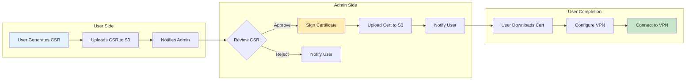
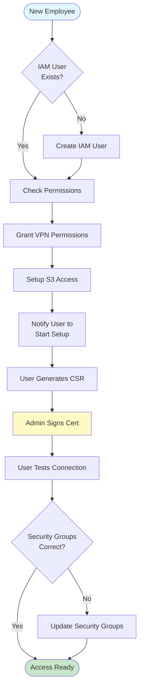
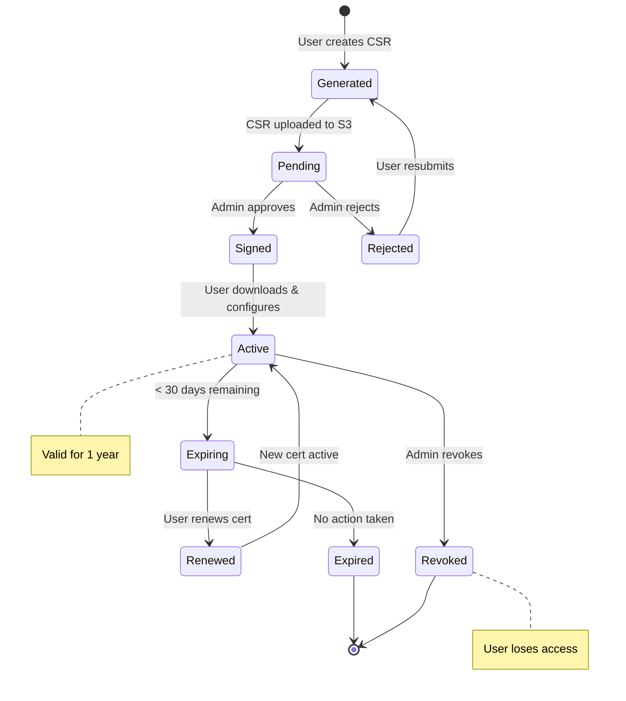
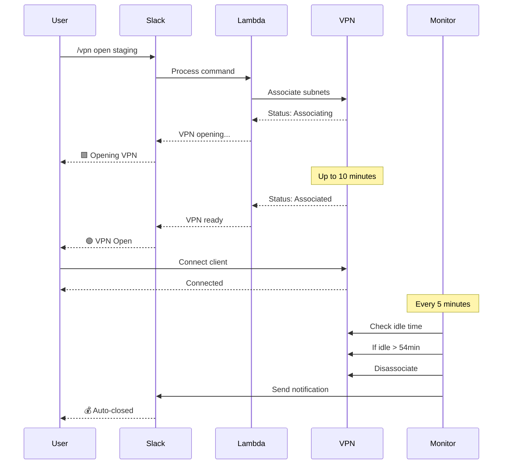

# VPN Administrator Guide

This guide provides VPN administrators with procedures and tools for managing the AWS Client VPN system, users, and certificates.

## 🎯 Who This Guide Is For

- VPN System Administrators
- Security Team Members
- IT Operations Staff
- Team Leads managing access

## 📈 Administrator Workflows

### Certificate Management Flow



### User Onboarding Process



## 📋 Administrator Responsibilities

### Core Duties
1. **User Management** - Add/remove VPN access permissions
2. **Certificate Management** - Sign CSRs, revoke certificates
3. **System Monitoring** - Track usage, costs, and health
4. **Incident Response** - Handle security events and outages

### Required AWS Permissions
- EC2 VPN endpoint management
- IAM user and policy management
- S3 access (certificate exchange)
- SSM Parameter Store access
- CloudWatch logs and metrics

## 🚀 Quick Start for New Admins

### 1. Setup Admin Access
```bash
# Configure AWS profiles
aws configure --profile staging
aws configure --profile production

# Verify access
aws sts get-caller-identity --profile staging
aws sts get-caller-identity --profile production
```

### 2. Launch Admin Console
```bash
./admin-tools/aws_vpn_admin.sh --profile staging
```

### 3. Initialize S3 Certificate Exchange
```bash
./admin-tools/setup_csr_s3_bucket.sh --publish-assets
```

## 👥 User Management

### Adding New Users

#### Step 1: Grant AWS Permissions
```bash
# Add VPN permissions to existing user
./admin-tools/manage_vpn_users.sh add john.doe --profile staging

# Create new IAM user with VPN access
./admin-tools/manage_vpn_users.sh add jane.smith --create-user --profile staging
```

#### Step 2: Process Certificate Request
When user submits CSR:
```bash
# Sign certificate and upload to S3
./admin-tools/sign_csr.sh --upload-s3 username.csr --profile staging
```

#### Step 3: Verify Access
```bash
# Check user permissions
./admin-tools/manage_vpn_users.sh status john.doe --profile staging

# List all VPN users
./admin-tools/manage_vpn_users.sh list --profile staging
```

### Batch User Operations

Create `users.txt`:

```text
john.doe
jane.smith
bob.wilson
```

Add multiple users:
```bash
./admin-tools/manage_vpn_users.sh batch-add users.txt --profile staging
```

### Removing User Access

#### Standard Removal
```bash
# Remove VPN permissions only
./admin-tools/manage_vpn_users.sh remove john.doe --profile staging

# Revoke certificate
./admin-tools/revoke_member_access.sh john.doe --profile staging
```

#### Complete Offboarding
⚠️ **Warning**: This permanently deletes IAM user and all access
```bash
./admin-tools/employee_offboarding.sh --profile production
```

## 📜 Certificate Management

### Certificate Lifecycle Management



### Certificate Workflow

1. **User generates CSR** → Uploads to S3
2. **Admin signs certificate** → Uploads to S3
3. **User downloads certificate** → Configures VPN

### Signing Certificates

#### Individual Signing
```bash
# Download and sign CSR
./admin-tools/sign_csr.sh username.csr --upload-s3 --profile staging
```

#### Batch Processing
```bash
# Monitor and auto-sign new CSRs
./admin-tools/process_csr_batch.sh monitor -e staging

# Process all pending CSRs
./admin-tools/process_csr_batch.sh download -e staging
./admin-tools/process_csr_batch.sh process -e staging
./admin-tools/process_csr_batch.sh upload --auto-upload
```

### Certificate Revocation
```bash
# Interactive revocation
./admin-tools/revoke_member_access.sh

# Specific user
./admin-tools/revoke_member_access.sh john.doe --profile staging
```

## 🔧 VPN Endpoint Management

⏱️ **Important Timing Note**: VPN endpoint operations (opening/associating) can take up to **10 minutes** to complete due to AWS subnet association and security group configuration processes. Always allow sufficient time for operations to finish.

### VPN Operation Flow



### Using Admin Console
```bash
./admin-tools/aws_vpn_admin.sh --profile staging
```

Menu Options:
1. **Create VPN Endpoint** - Setup new VPN
2. **View Endpoints** - Check status
3. **Manage Team Members** - User operations
4. **Generate Client Config** - Create .ovpn files
5. **Delete Endpoint** - Remove VPN

### Manual Endpoint Operations

#### Create Endpoint
```bash
# Via admin console (recommended)
./admin-tools/aws_vpn_admin.sh --profile staging
# Select option 1
```

#### Fix Common Issues
```bash
# Fix endpoint ID mismatch
./admin-tools/tools/fix_endpoint_id.sh

# Fix internet access
./admin-tools/tools/fix_internet_access.sh

# Validate configuration
./admin-tools/tools/validate_config.sh
```

## 📊 Monitoring and Reporting

### Daily Monitoring Tasks

#### Check System Health
```bash
# VPN status overview
./admin-tools/aws_vpn_admin.sh --profile staging

# Active connections
aws ec2 describe-client-vpn-connections \
  --client-vpn-endpoint-id cvpn-endpoint-xxxxx \
  --profile staging
```

#### Cost Monitoring
```bash
# Generate cost analysis
./admin-tools/run-vpn-analysis.sh --profile staging

# View via Slack
/vpn savings staging
/vpn costs daily
```

### Automated Reports

#### Setup Weekly Reports
```bash
# Schedule weekly analysis
crontab -e
# Add: 0 9 * * MON /path/to/admin-tools/run-vpn-analysis.sh --format markdown
```

### CloudWatch Monitoring

View Lambda logs:
```bash
# Slack handler logs
aws logs tail /aws/lambda/vpn-slack-handler-staging --follow --profile staging

# Monitor errors
aws logs filter-log-events \
  --log-group-name /aws/lambda/vpn-control-staging \
  --filter-pattern "ERROR" \
  --profile staging
```

## 🚨 Incident Response

### VPN Outage

1. **Check endpoint status**:
```bash
aws ec2 describe-client-vpn-endpoints --profile staging
```

2. **Restart VPN via Slack**:
```text
/vpn open staging
```

⏱️ **Note**: Allow up to 10 minutes for the VPN endpoint to fully associate and become available.

3. **Check Lambda functions**:
```bash
./scripts/deploy.sh status
```

4. **Emergency redeploy**:
```bash
./scripts/deploy.sh staging --secure-parameters
```

### Security Incident

1. **Immediate Actions**:
```bash
# Revoke compromised certificate
./admin-tools/revoke_member_access.sh compromised-user --profile production

# Disconnect all users
/vpn close production
```

2. **Investigation**:
```bash
# Check access logs
aws cloudtrail lookup-events \
  --lookup-attributes AttributeKey=EventName,AttributeValue=AuthorizeClientVpnIngress \
  --profile production
```

3. **Recovery**:
- Regenerate certificates
- Update security groups
- Notify affected users

### Cost Anomaly

1. **Check auto-close status**:
```
/vpn admin cooldown staging
```

2. **Force close if needed**:
```
/vpn admin force-close staging
```

3. **Adjust idle timeout**:
```bash
aws ssm put-parameter \
  --name "/vpn/staging/cost/optimization_config" \
  --value '{"idleTimeoutMinutes":54}' \
  --overwrite \
  --profile staging
```

## 🛠️ Administrative Tools Reference

### Essential Tools

| Tool | Purpose | Usage |
|------|---------|-------|
| `aws_vpn_admin.sh` | Main admin console | `./admin-tools/aws_vpn_admin.sh --profile staging` |
| `manage_vpn_users.sh` | User management | `./admin-tools/manage_vpn_users.sh add user` |
| `sign_csr.sh` | Certificate signing | `./admin-tools/sign_csr.sh --upload-s3 user.csr` |
| `setup_csr_s3_bucket.sh` | S3 setup | `./admin-tools/setup_csr_s3_bucket.sh --publish-assets` |
| `run-vpn-analysis.sh` | Cost analysis | `./admin-tools/run-vpn-analysis.sh --profile staging` |

### Diagnostic Tools

| Tool | Purpose | When to Use |
|------|---------|-------------|
| `validate_config.sh` | Check configuration | Setup issues |
| `fix_endpoint_id.sh` | Fix endpoint mismatch | ID errors |
| `fix_internet_access.sh` | Repair routing | No internet via VPN |
| `debug_vpn_creation.sh` | Debug creation | Endpoint creation fails |

## 💰 Cost Management

### Cost Optimization Features

- **Auto-shutdown**: Closes VPN after 54 minutes idle
- **Business hours protection**: Prevents shutdown during work hours
- **Admin override**: Disable auto-close for maintenance

### Managing Auto-Close

```bash
# Disable auto-close for 24 hours
/vpn admin noclose staging

# Re-enable auto-close
/vpn admin autoclose staging

# Check cooldown status
/vpn admin cooldown staging
```

### Cost Analysis
```bash
# Monthly cost report
./admin-tools/run-vpn-analysis.sh --start-date 2025-01-01 --end-date 2025-01-31

# Compare environments
/vpn costs cumulative
```

## 🔒 Security Best Practices

### Certificate Security
1. **CA Key Protection**
   - Store offline in encrypted storage
   - Never commit to repository
   - Limit access to 2-3 admins

2. **Certificate Lifecycle**
   - Set 1-year expiration
   - Track expiration dates
   - Rotate CA every 2-3 years

### Access Control
1. **Principle of Least Privilege**
   - Grant minimal required permissions
   - Regular access reviews (monthly)
   - Remove unused accounts

2. **Environment Separation**
   - Different certificates per environment
   - Separate AWS accounts recommended
   - No cross-environment access

### Audit and Compliance
1. **Enable CloudTrail**
2. **Regular security audits**
3. **Document all access changes**
4. **Maintain revocation lists**

## 📋 Administrative Procedures

### Daily Tasks (5 minutes)

- [ ] Check VPN endpoint status
- [ ] Process pending CSRs
- [ ] Review error logs

### Weekly Tasks (15 minutes)

- [ ] Generate usage report
- [ ] Review user permissions
- [ ] Check certificate expirations

### Monthly Tasks (30 minutes)

- [ ] Full access audit
- [ ] Cost analysis review
- [ ] Update documentation
- [ ] Test disaster recovery

## 🆘 Getting Help

### Internal Resources
- Slack: #vpn-admin channel
- Wiki: Internal VPN documentation
- Team: security@company.com

### External Resources
- [AWS Client VPN Documentation](https://docs.aws.amazon.com/vpn/latest/clientvpn-admin/)
- [GitHub Issues](https://github.com/your-org/vpn-toolkit/issues)
- AWS Support Console

---

**For Deployment:** See [Deployment Guide](deployment-guide.md)
**For Architecture:** See [Architecture Documentation](architecture.md)