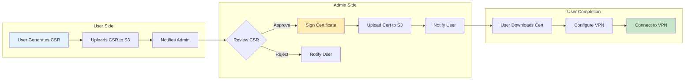
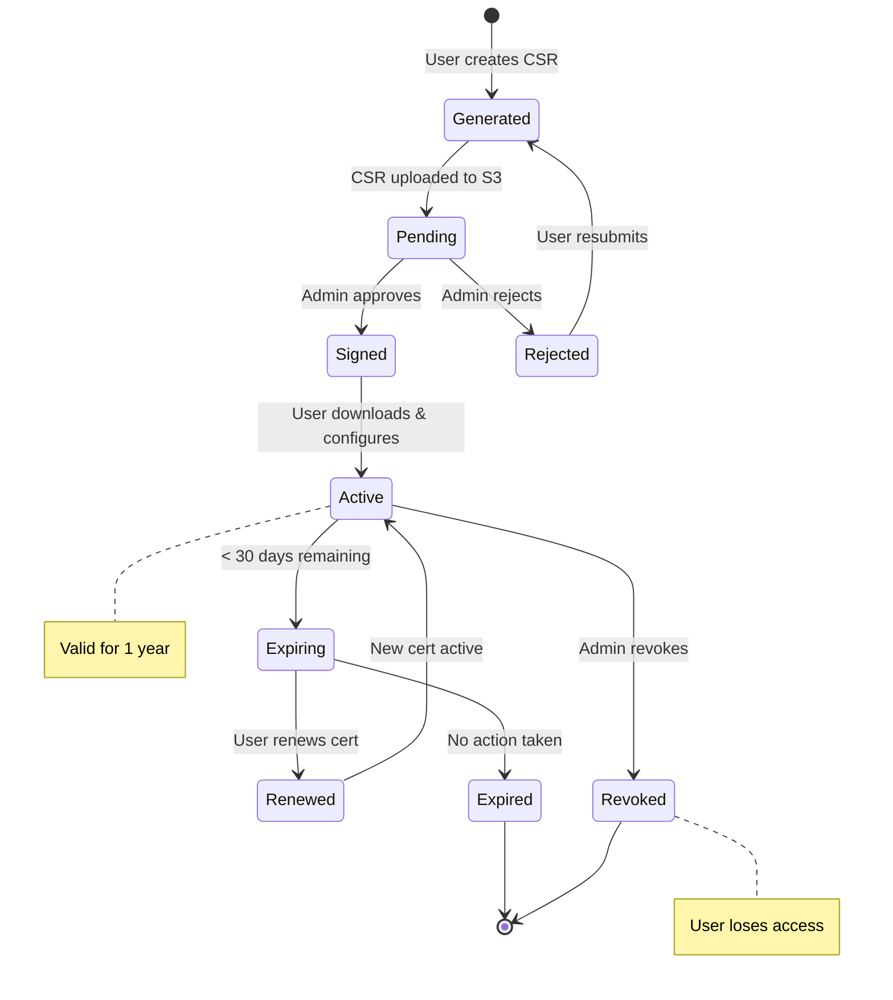
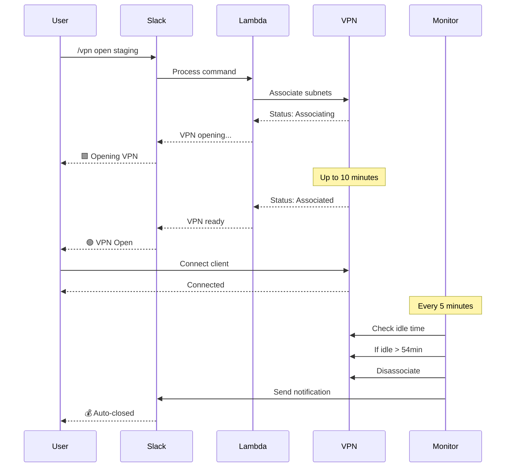

# VPN 管理員指南

本指南為 VPN 管理員提供管理 AWS Client VPN 系統、使用者和憑證的程序和工具。

## 📑 目錄

- [本指南適用對象](#-本指南適用對象)
- [管理員工作流程](#-管理員工作流程)
- [管理員職責](#-管理員職責)
- [新管理員快速入門](#-新管理員快速入門)
- [使用者管理](#-使用者管理)
- [憑證管理](#-憑證管理)
- [VPN 端點管理](#-vpn-端點管理)
- [監控和報告](#-監控和報告)
- [事件響應](#-事件響應)
- [管理工具參考](#️-管理工具參考)
- [成本管理](#-成本管理)
- [安全最佳實踐](#-安全最佳實踐)
- [管理程序](#-管理程序)
- [取得協助](#-取得協助)

## 🎯 本指南適用對象

- VPN 系統管理員
- 安全團隊成員
- IT 營運人員
- 管理存取權限的團隊主管

## 📈 管理員工作流程

### 憑證管理流程



### 使用者入職流程


## 📋 管理員職責

### 核心職責
1. **使用者管理** - 新增/移除 VPN 存取權限
2. **憑證管理** - 簽署 CSR、撤銷憑證
3. **系統監控** - 追蹤使用情況、成本和健康狀態
4. **事件響應** - 處理安全事件和服務中斷

### 所需的 AWS 權限
- EC2 VPN 端點管理
- IAM 使用者和政策管理
- S3 存取（憑證交換）
- SSM Parameter Store 存取
- CloudWatch 日誌和指標

## 🚀 新管理員快速入門

### 1. 設定管理員存取
```bash
# 設定 AWS 設定檔
aws configure --profile staging
aws configure --profile production

# 驗證存取
aws sts get-caller-identity --profile staging
aws sts get-caller-identity --profile production
```

### 2. 啟動管理控制台
```bash
# 自動偵測並選擇 AWS profile（推薦）
./admin-tools/aws_vpn_admin.sh

# 或指定特定 profile（可選）
./admin-tools/aws_vpn_admin.sh --profile staging
```

### 3. 驗證系統存取
```bash
# 測試基本 VPN 管理功能（自動選擇 profile）
./admin-tools/aws_vpn_admin.sh

# 或指定特定 profile
./admin-tools/aws_vpn_admin.sh --profile staging
```

**註：** S3 憑證交換系統的初始部署和基礎設施設定請參閱 [部署指南](deployment-guide.md)。

## 👥 使用者管理

### 新增使用者

#### 步驟 1：授予 AWS 權限
```bash
# 為現有使用者新增 VPN 權限
./admin-tools/manage_vpn_users.sh add john.doe --profile staging

# 建立具有 VPN 存取權的新 IAM 使用者
./admin-tools/manage_vpn_users.sh add jane.smith --create-user --profile staging
```

#### 步驟 2：處理憑證請求
當使用者提交 CSR 時：
```bash
# 簽署憑證並上傳至 S3
./admin-tools/sign_csr.sh --upload-s3 username.csr --profile staging
```

#### 步驟 3：驗證存取
```bash
# 檢查使用者權限
./admin-tools/manage_vpn_users.sh status john.doe --profile staging

# 列出所有 VPN 使用者
./admin-tools/manage_vpn_users.sh list --profile staging
```

### 批次使用者操作

建立 `users.txt`：

```text
john.doe
jane.smith
bob.wilson
```

新增多個使用者：
```bash
./admin-tools/manage_vpn_users.sh batch-add users.txt --profile staging
```

### 移除使用者存取

#### 標準移除
```bash
# 僅移除 VPN 權限
./admin-tools/manage_vpn_users.sh remove john.doe --profile staging

# 撤銷憑證
./admin-tools/revoke_member_access.sh john.doe --profile staging
```

#### 完整離職
⚠️ **警告**：這將永久刪除 IAM 使用者和所有存取權
```bash
./admin-tools/employee_offboarding.sh --profile production
```

## 📜 憑證管理

### 憑證生命週期管理



### 憑證工作流程

1. **使用者產生 CSR** → 上傳至 S3
2. **管理員簽署憑證** → 上傳至 S3
3. **使用者下載憑證** → 設定 VPN

### 簽署憑證

#### 個別簽署
```bash
# 下載並簽署 CSR
./admin-tools/sign_csr.sh username.csr --upload-s3 --profile staging
```

#### 批次處理
```bash
# 監控並自動簽署新的 CSR
./admin-tools/process_csr_batch.sh monitor -e staging

# 處理所有待處理的 CSR
./admin-tools/process_csr_batch.sh download -e staging
./admin-tools/process_csr_batch.sh process -e staging
./admin-tools/process_csr_batch.sh upload --auto-upload
```

### 憑證撤銷
```bash
# 互動式撤銷
./admin-tools/revoke_member_access.sh

# 特定使用者
./admin-tools/revoke_member_access.sh john.doe --profile staging
```

## 🔧 VPN 端點管理

⏱️ **重要時間提醒**：由於 AWS 子網路關聯和安全群組設定流程，VPN 端點操作（開啟/關聯）可能需要最多 **10 分鐘**才能完成。請始終預留充足的時間讓操作完成。

### VPN 操作流程



### 使用管理控制台
```bash
# 自動選擇 profile（推薦）
./admin-tools/aws_vpn_admin.sh

# 或指定特定 profile
./admin-tools/aws_vpn_admin.sh --profile staging
```

選單選項：
1. **建立 VPN 端點** - 設定新 VPN
2. **檢視端點** - 檢查狀態
3. **管理團隊成員** - 使用者操作
4. **產生用戶端設定** - 建立 .ovpn 檔案
5. **刪除端點** - 移除 VPN

### 手動端點操作

#### 建立端點
```bash
# 透過管理控制台（建議）
./admin-tools/aws_vpn_admin.sh
# 選擇選項 1
```

#### 修復常見問題
```bash
# 修復端點 ID 不符
./admin-tools/tools/fix_endpoint_id.sh

# 修復網際網路存取
./admin-tools/tools/fix_internet_access.sh

# 驗證設定
./admin-tools/tools/validate_config.sh
```

## 📊 監控和報告

### 每日監控任務

#### 檢查系統健康狀態
```bash
# VPN 狀態概覽
./admin-tools/aws_vpn_admin.sh

# 活動連線
aws ec2 describe-client-vpn-connections \
  --client-vpn-endpoint-id cvpn-endpoint-xxxxx \
  --profile staging
```

#### 成本監控
```bash
# 產生成本分析
./admin-tools/run-vpn-analysis.sh --profile staging

# 透過 Slack 檢視
/vpn savings staging
/vpn costs daily
```

### 自動化報告

#### 設定每週報告
```bash
# 排程每週分析
crontab -e
# 新增：0 9 * * MON /path/to/admin-tools/run-vpn-analysis.sh --format markdown
```

### CloudWatch 監控

檢視 Lambda 日誌：
```bash
# Slack 處理程式日誌
aws logs tail /aws/lambda/vpn-slack-handler-staging --follow --profile staging

# 監控錯誤
aws logs filter-log-events \
  --log-group-name /aws/lambda/vpn-control-staging \
  --filter-pattern "ERROR" \
  --profile staging
```

## 🚨 事件響應

### VPN 服務中斷

1. **檢查端點狀態**：
```bash
aws ec2 describe-client-vpn-endpoints --profile staging
```

2. **透過 Slack 重新啟動 VPN**：
```text
/vpn open staging
```

⏱️ **注意**：請預留最多 10 分鐘讓 VPN 端點完全關聯並可用。

3. **檢查 Lambda 函數**：
```bash
./scripts/deploy.sh status
```

4. **緊急重新部署**：
```bash
./scripts/deploy.sh staging --secure-parameters
```

### 安全事件

1. **立即行動**：
```bash
# 撤銷受損憑證
./admin-tools/revoke_member_access.sh compromised-user --profile production

# 中斷所有使用者連線
/vpn close production
```

2. **調查**：
```bash
# 檢查存取日誌
aws cloudtrail lookup-events \
  --lookup-attributes AttributeKey=EventName,AttributeValue=AuthorizeClientVpnIngress \
  --profile production
```

3. **復原**：
- 重新產生憑證
- 更新安全群組
- 通知受影響的使用者

### 成本異常

1. **檢查自動關閉狀態**：
```
/vpn admin cooldown staging
```

2. **必要時強制關閉**：
```
/vpn admin force-close staging
```

3. **調整閒置逾時**：
```bash
aws ssm put-parameter \
  --name "/vpn/staging/cost/optimization_config" \
  --value '{"idleTimeoutMinutes":54}' \
  --overwrite \
  --profile staging
```

## 🛠️ 管理工具參考

### 必要工具

| 工具 | 用途 | 使用方式 |
|------|---------|-------|
| `aws_vpn_admin.sh` | 主要管理控制台 | `./admin-tools/aws_vpn_admin.sh --profile staging` |
| `manage_vpn_users.sh` | 使用者管理 | `./admin-tools/manage_vpn_users.sh add user` |
| `sign_csr.sh` | 憑證簽署 | `./admin-tools/sign_csr.sh --upload-s3 user.csr` |
| `setup_csr_s3_bucket.sh` | S3 設定 | `./admin-tools/setup_csr_s3_bucket.sh --publish-assets` |
| `run-vpn-analysis.sh` | 成本分析 | `./admin-tools/run-vpn-analysis.sh --profile staging` |

### 診斷工具

| 工具 | 用途 | 使用時機 |
|------|---------|-------------|
| `validate_config.sh` | 檢查設定 | 設定問題 |
| `fix_endpoint_id.sh` | 修復端點不符 | ID 錯誤 |
| `fix_internet_access.sh` | 修復路由 | 無法透過 VPN 上網 |
| `debug_vpn_creation.sh` | 除錯建立 | 端點建立失敗 |

## 💰 成本管理

### 成本最佳化功能

- **自動關閉**：閒置 54 分鐘後關閉 VPN
- **工作時間保護**：防止在工作時間關閉
- **管理員覆寫**：維護期間停用自動關閉

### 管理自動關閉

```bash
# 停用自動關閉 24 小時
/vpn admin noclose staging

# 重新啟用自動關閉
/vpn admin autoclose staging

# 檢查冷卻狀態
/vpn admin cooldown staging
```

### 成本分析
```bash
# 月度成本報告
./admin-tools/run-vpn-analysis.sh --start-date 2025-01-01 --end-date 2025-01-31

# 比較環境
/vpn costs cumulative
```

## 🔒 安全最佳實踐

### 憑證安全
1. **CA 金鑰保護**
   - 離線儲存於加密儲存空間
   - 絕不提交至儲存庫
   - 限制 2-3 位管理員存取

2. **憑證生命週期**
   - 設定 1 年到期
   - 追蹤到期日期
   - 每 2-3 年輪換 CA

### 存取控制
1. **最小權限原則**
   - 授予最少必要權限
   - 定期存取檢視（每月）
   - 移除未使用的帳戶

2. **環境分離**
   - 每個環境使用不同憑證
   - 建議使用獨立的 AWS 帳戶
   - 禁止跨環境存取

### 稽核與合規
1. **啟用 CloudTrail**
2. **定期安全稽核**
3. **記錄所有存取變更**
4. **維護撤銷清單**

## 📋 管理程序

### 每日任務（5 分鐘）

- [ ] 檢查 VPN 端點狀態
- [ ] 處理待處理的 CSR
- [ ] 檢視錯誤日誌

### 每週任務（15 分鐘）

- [ ] 產生使用報告
- [ ] 檢視使用者權限
- [ ] 檢查憑證到期

### 每月任務（30 分鐘）

- [ ] 完整存取稽核
- [ ] 成本分析檢視
- [ ] 更新文件
- [ ] 測試災難復原

## 🆘 取得協助

### 內部資源
- Slack：#vpn-admin 頻道
- Wiki：內部 VPN 文件
- 團隊：security@company.com

### 外部資源
- [AWS Client VPN 文件](https://docs.aws.amazon.com/vpn/latest/clientvpn-admin/)
- [GitHub Issues](https://github.com/your-org/vpn-toolkit/issues)
- AWS 支援控制台

---

**部署相關：**請參閱[部署指南](deployment-guide.md)
**架構相關：**請參閱[架構文件](architecture.md)