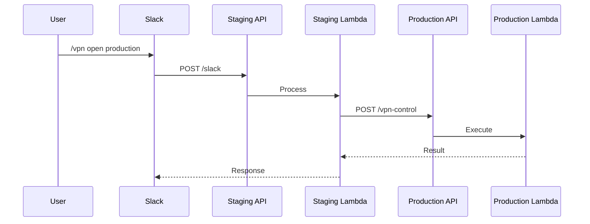

# 系統架構文件

本文件提供 AWS Client VPN 管理系統架構、設計決策和實作細節的技術詳情。

## 🎯 目標讀者

- 軟體架構師
- 資深工程師
- 資安工程師
- 需要深入技術理解的任何人

## 🏗️ 高階架構

### 系統概覽

```
┌─────────────────────────────────────────────────────────┐
│                     Slack Interface                      │
├─────────────────────────────────────────────────────────┤
│                    API Gateway (REST)                    │
├─────────────────────────────────────────────────────────┤
│                   Lambda Functions                       │
│  ┌──────────┐  ┌──────────┐  ┌──────────┐             │
│  │  Slack   │  │   VPN    │  │   VPN    │             │
│  │ Handler  │→ │ Control  │  │ Monitor  │             │
│  └──────────┘  └──────────┘  └──────────┘             │
├─────────────────────────────────────────────────────────┤
│              AWS Services Layer                          │
│  ┌──────────┐  ┌──────────┐  ┌──────────┐             │
│  │   SSM    │  │    EC2   │  │CloudWatch│             │
│  │Parameter │  │  Client  │  │  Events  │             │
│  │  Store   │  │   VPN    │  │          │             │
│  └──────────┘  └──────────┘  └──────────┘             │
└─────────────────────────────────────────────────────────┘
```

### 技術堆疊

- **基礎設施**: AWS CDK v2 (TypeScript)
- **執行環境**: Node.js 20.x
- **API**: 透過 API Gateway 的 REST API
- **函數**: AWS Lambda (無伺服器)
- **排程**: EventBridge (CloudWatch Events)
- **狀態**: SSM Parameter Store
- **安全**: KMS、IAM、安全群組
- **監控**: CloudWatch Logs/Metrics

## 🌐 網路架構

### VPC 整合

```
Internet Gateway
       ↓
    [NAT Gateway]
       ↓
┌─────────────────────────────────┐
│      VPC (10.0.0.0/16)          │
├─────────────────────────────────┤
│   Public Subnet (10.0.1.0/24)   │
│   [Client VPN Endpoint]          │
├─────────────────────────────────┤
│  Private Subnet (10.0.2.0/24)   │
│   [Internal Services]            │
├─────────────────────────────────┤
│  Private Subnet (10.0.3.0/24)   │
│   [Databases]                    │
└─────────────────────────────────┘
```

### Client VPN 設定

#### 連線流程
1. 客戶端 → VPN 端點 (TLS 1.2+)
2. 憑證驗證
3. 從 VPN CIDR (172.16.0.0/22) 分配 IP
4. 建立到 VPC 的路由
5. 流量通過安全群組

#### 路由規則
- VPN CIDR → 本地
- VPC CIDR → 目標網路關聯
- 0.0.0.0/0 → NAT 閘道 (分割隧道)

### 安全群組

#### 專屬 VPN 安全群組
```json
{
  "GroupName": "client-vpn-sg-{environment}",
  "Ingress": [],  // No ingress needed
  "Egress": [
    {
      "Protocol": "ALL",
      "Destination": "0.0.0.0/0"
    }
  ]
}
```

#### 服務存取模式
```bash
# 服務安全群組參照 VPN 安全群組
aws ec2 authorize-security-group-ingress \
  --group-id sg-service \
  --source-group sg-vpn-client \
  --protocol tcp \
  --port 3306
```

## ⚡ 無伺服器架構

### Lambda 函數

#### slack-handler
- **用途**: 處理 Slack 命令
- **記憶體**: 512 MB
- **逾時**: 30 秒
- **觸發器**: API Gateway POST /slack

#### vpn-control
- **用途**: 執行 VPN 操作
- **記憶體**: 512 MB
- **逾時**: 60 秒
- **觸發器**: 內部調用

#### vpn-monitor
- **用途**: 自動關閉監控
- **記憶體**: 256 MB
- **逾時**: 30 秒
- **觸發器**: EventBridge (5 分鐘間隔)

### Lambda Layer 結構

```
/opt/nodejs/
├── logger.ts       # 結構化日誌
├── slack.ts        # Slack 工具
├── stateStore.ts   # SSM 整合
├── types.ts        # TypeScript 類型
└── vpnManager.ts   # VPN 操作
```

### 冷啟動最佳化

#### Lambda 預熱系統
透過排程預熱消除冷啟動：

```typescript
// 預熱偵測
const isWarmingRequest = (event: any): boolean => {
  return event.source === 'aws.events' &&
         event['detail-type'] === 'Scheduled Event' &&
         event.detail?.warming === true;
};

// 預熱響應
if (isWarmingRequest(event)) {
  return { statusCode: 200, body: 'Warmed' };
}
```

**排程**:
- 工作時間：每 3 分鐘
- 非工作時間：每 15 分鐘
- 週末：每 30 分鐘
- 月度成本：約 $8-12

## 🔐 安全架構

### 憑證管理

#### PKI 層級結構
```
根 CA (自簽，10 年有效期)
├── 伺服器憑證 (VPN 端點)
└── 客戶端憑證 (1 年有效期)
    ├── user1.crt
    ├── user2.crt
    └── ...
```

#### 零接觸工作流程
1. 使用者本地生成 CSR
2. CSR 上傳至 S3 (`csr/` 前綴)
3. 管理員簽署憑證
4. 憑證上傳至 S3 (`cert/` 前綴)
5. 使用者下載憑證

### IAM 安全

#### Lambda 執行角色
```json
{
  "Version": "2012-10-17",
  "Statement": [
    {
      "Effect": "Allow",
      "Action": [
        "ec2:DescribeClientVpnEndpoints",
        "ec2:AssociateClientVpnTargetNetwork",
        "ec2:DisassociateClientVpnTargetNetwork"
      ],
      "Resource": "*",
      "Condition": {
        "StringEquals": {
          "aws:RequestedRegion": "${aws:Region}"
        }
      }
    }
  ]
}
```

### 加密

#### KMS 使用
- SSM 參數使用 KMS 加密
- S3 儲存桶靜態加密
- 所有 API 通訊使用 TLS 1.2+

#### Slack 請求驗證
```typescript
function verifySlackSignature(
  body: string,
  signature: string,
  timestamp: string,
  secret: string
): boolean {
  const baseString = `v0:${timestamp}:${body}`;
  const hmac = crypto.createHmac('sha256', secret);
  const expected = `v0=${hmac.update(baseString).digest('hex')}`;
  return crypto.timingSafeEqual(
    Buffer.from(signature),
    Buffer.from(expected)
  );
}
```

## 💰 成本最佳化

### 自動關閉演算法

#### 54 分鐘最佳化
```
AWS 計費：按小時收費，最少 1 小時

傳統方式 (60 分鐘闾值)：
最壞情況 = 59 分鐘閒置 + 5 分鐘偵測 = 64 分鐘
結果：跨入第 2 個計費小時 ❌

最佳化 (54 分鐘闾值)：
最壞情況 = 54 分鐘閒置 + 5 分鐘偵測 = 59 分鐘
結果：保持在第 1 個計費小時內 ✅

節省：100% 防止意外的第 2 小時費用
```

#### 實作
```typescript
async function checkIdleStatus(): Promise<boolean> {
  const IDLE_MINUTES = 54;
  const lastActivity = await getLastActivity();
  const idleTime = (Date.now() - lastActivity) / 60000;

  return idleTime >= IDLE_MINUTES &&
         !isBusinessHours() &&
         !hasAdminOverride();
}
```

### 成本計算

#### 定價模型
```
每小時成本 = (端點關聯 × 子網路) + (活動連線 × 使用者)
          = ($0.10 × 1) + ($0.05 × N)

每日節省 = (24 - 實際小時) × 每小時成本
年度節省 = 每日節省 × 工作日 × 12
```

#### 實際節省
- 傳統 24/7：$132/月
- 自動化後：$35-57/月
- 節省：減少 57-74%

## 🔄 狀態管理

### SSM Parameter Store

#### 命名慣例
```
/vpn/{environment}/{category}/{key}

Examples:
/vpn/staging/endpoint/conf
/vpn/production/state/last_activity
/vpn/slack/signing_secret
```

#### 狀態同步
```typescript
// 並發更新的樂觀鎖定
async function updateStateWithRetry(
  key: string,
  updater: (current: any) => any,
  maxRetries = 3
): Promise<void> {
  for (let i = 0; i < maxRetries; i++) {
    const current = await readState(key);
    const updated = updater(current);

    try {
      await writeState(key, updated);
      return;
    } catch (error) {
      if (i === maxRetries - 1) throw error;
    }
  }
}
```

## 🌍 跨帳戶通訊

### 請求路由



### 實作
```typescript
async function routeCommand(cmd: VpnCommand): Promise<any> {
  if (cmd.environment === CURRENT_ENV) {
    return await invokeLocal(cmd);
  }

  const targetUrl = getTargetApiUrl(cmd.environment);
  return await fetch(`${targetUrl}/vpn-control`, {
    method: 'POST',
    body: JSON.stringify(cmd)
  });
}
```

## 📊 監控與可觀察性

### 結構化日誌

```typescript
interface LogEntry {
  timestamp: string;
  level: 'DEBUG' | 'INFO' | 'WARN' | 'ERROR';
  message: string;
  correlationId: string;
  requestId: string;
  environment: string;
  metadata?: Record<string, any>;
}

class Logger {
  log(level: LogLevel, message: string, meta?: any) {
    console.log(JSON.stringify({
      timestamp: new Date().toISOString(),
      level,
      message,
      ...this.context,
      metadata: meta
    }));
  }
}
```

### 指標

#### 自訂 CloudWatch 指標
- `VPN/Automation/VpnOpenOperations`
- `VPN/Automation/VpnCloseOperations`
- `VPN/Automation/AutoCloseTriggered`
- `VPN/Automation/CostSaved`
- `VPN/Automation/IdleMinutesDetected`

#### 關鍵績效指標
- Slack 響應時間：< 1 秒
- VPN 操作完成：< 60 秒
- 自動關閉準確率：100%
- 成本節省：> 50%

## 🚀 效能考量

### 最佳化策略

1. **連線池化**：重用 AWS SDK 客戶端
2. **快取**：設定 5 分鐘快取
3. **平行處理**：盡可能批次操作
4. **記憶體配置**：根據函數需求最佳化

### 擴展性限制

| 元件 | 限制 | 緩解措施 |
|------|------|----------|
| Lambda 並發 | 1000 | 保留容量 |
| API Gateway | 10k 請求/秒 | 速率限制 |
| SSM 參數 | 4KB | 大資料使用 S3 |
| VPN 連線 | 2000/端點 | 多個端點 |

## 🔮 未來增強功能

### 計劃功能
- 多區域支援
- 使用預測的機器學習
- 行動應用整合
- WireGuard 協定支援
- 細粒度存取控制

### 架構演進
- 基於容器的替代方案
- GraphQL API 遷移
- 事件驅動架構擴展
- 即時監控儀表板

## 📚 技術參考

### 使用的 AWS 服務
- [EC2 Client VPN](https://docs.aws.amazon.com/vpn/latest/clientvpn-admin/)
- [Lambda](https://docs.aws.amazon.com/lambda/)
- [API Gateway](https://docs.aws.amazon.com/apigateway/)
- [SSM Parameter Store](https://docs.aws.amazon.com/systems-manager/latest/userguide/systems-manager-parameter-store.html)
- [EventBridge](https://docs.aws.amazon.com/eventbridge/)

### 設計模式
- 無伺服器優先
- 基礎設施即程式碼
- 零信任安全
- 成本最佳化架構
- 事件驅動處理

---

**操作相關：**請參閱[部署指南](deployment-guide.md)
**管理相關：**請參閱[管理員指南](admin-guide.md)