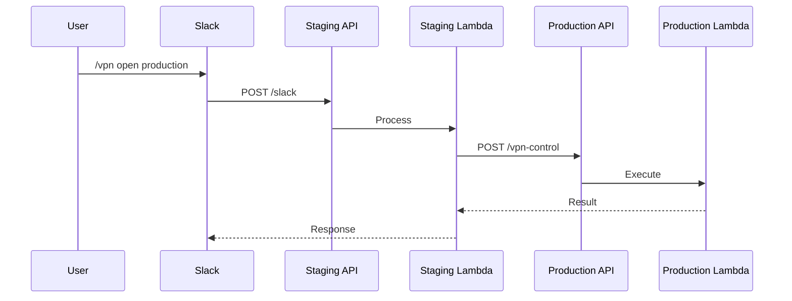

# System Architecture Documentation

This document provides technical details about the AWS Client VPN management system architecture, design decisions, and implementation details.

## 🎯 Target Audience

- Software Architects
- Senior Engineers
- Security Engineers
- Anyone needing deep technical understanding

## 🏗️ High-Level Architecture

### System Overview

```
┌─────────────────────────────────────────────────────────┐
│                     Slack Interface                      │
├─────────────────────────────────────────────────────────┤
│                    API Gateway (REST)                    │
├─────────────────────────────────────────────────────────┤
│                   Lambda Functions                       │
│  ┌──────────┐  ┌──────────┐  ┌──────────┐             │
│  │  Slack   │  │   VPN    │  │   VPN    │             │
│  │ Handler  │→ │ Control  │  │ Monitor  │             │
│  └──────────┘  └──────────┘  └──────────┘             │
├─────────────────────────────────────────────────────────┤
│              AWS Services Layer                          │
│  ┌──────────┐  ┌──────────┐  ┌──────────┐             │
│  │   SSM    │  │    EC2   │  │CloudWatch│             │
│  │Parameter │  │  Client  │  │  Events  │             │
│  │  Store   │  │   VPN    │  │          │             │
│  └──────────┘  └──────────┘  └──────────┘             │
└─────────────────────────────────────────────────────────┘
```

### Technology Stack

- **Infrastructure**: AWS CDK v2 (TypeScript)
- **Runtime**: Node.js 20.x
- **API**: REST API via API Gateway
- **Functions**: AWS Lambda (Serverless)
- **Scheduling**: EventBridge (CloudWatch Events)
- **State**: SSM Parameter Store
- **Security**: KMS, IAM, Security Groups
- **Monitoring**: CloudWatch Logs/Metrics

## 🌐 Network Architecture

### VPC Integration

```
Internet Gateway
       ↓
    [NAT Gateway]
       ↓
┌─────────────────────────────────┐
│      VPC (10.0.0.0/16)          │
├─────────────────────────────────┤
│   Public Subnet (10.0.1.0/24)   │
│   [Client VPN Endpoint]          │
├─────────────────────────────────┤
│  Private Subnet (10.0.2.0/24)   │
│   [Internal Services]            │
├─────────────────────────────────┤
│  Private Subnet (10.0.3.0/24)   │
│   [Databases]                    │
└─────────────────────────────────┘
```

### Client VPN Configuration

#### Connection Flow
1. Client → VPN Endpoint (TLS 1.2+)
2. Certificate validation
3. IP assignment from VPN CIDR (172.16.0.0/22)
4. Route establishment to VPC
5. Traffic flow through security groups

#### Routing Rules
- VPN CIDR → Local
- VPC CIDR → Target Network Association
- 0.0.0.0/0 → NAT Gateway (split tunnel)

### Security Groups

#### Dedicated VPN Security Group
```json
{
  "GroupName": "client-vpn-sg-{environment}",
  "Ingress": [],  // No ingress needed
  "Egress": [
    {
      "Protocol": "ALL",
      "Destination": "0.0.0.0/0"
    }
  ]
}
```

#### Service Access Pattern
```bash
# Service SG references VPN SG
aws ec2 authorize-security-group-ingress \
  --group-id sg-service \
  --source-group sg-vpn-client \
  --protocol tcp \
  --port 3306
```

## ⚡ Serverless Architecture

### Lambda Functions

#### slack-handler
- **Purpose**: Process Slack commands
- **Memory**: 512 MB
- **Timeout**: 30 seconds
- **Triggers**: API Gateway POST /slack

#### vpn-control
- **Purpose**: Execute VPN operations
- **Memory**: 512 MB
- **Timeout**: 60 seconds
- **Triggers**: Internal invocation

#### vpn-monitor
- **Purpose**: Auto-shutdown monitoring
- **Memory**: 256 MB
- **Timeout**: 30 seconds
- **Triggers**: EventBridge (5-minute interval)

### Lambda Layer Structure

```
/opt/nodejs/
├── logger.ts       # Structured logging
├── slack.ts        # Slack utilities
├── stateStore.ts   # SSM integration
├── types.ts        # TypeScript types
└── vpnManager.ts   # VPN operations
```

### Cold Start Optimization

#### Lambda Warming System
Eliminates cold starts through scheduled warming:

```typescript
// Warming detection
const isWarmingRequest = (event: any): boolean => {
  return event.source === 'aws.events' &&
         event['detail-type'] === 'Scheduled Event' &&
         event.detail?.warming === true;
};

// Warming response
if (isWarmingRequest(event)) {
  return { statusCode: 200, body: 'Warmed' };
}
```

**Schedule**:
- Business hours: Every 3 minutes
- Off hours: Every 15 minutes
- Weekends: Every 30 minutes
- Monthly cost: ~$8-12

## 🔐 Security Architecture

### Certificate Management

#### PKI Hierarchy
```
Root CA (Self-signed, 10-year validity)
├── Server Certificate (VPN Endpoint)
└── Client Certificates (1-year validity)
    ├── user1.crt
    ├── user2.crt
    └── ...
```

#### Zero-Touch Workflow
1. User generates CSR locally
2. CSR uploaded to S3 (`csr/` prefix)
3. Admin signs certificate
4. Certificate uploaded to S3 (`cert/` prefix)
5. User downloads certificate

### IAM Security

#### Lambda Execution Role
```json
{
  "Version": "2012-10-17",
  "Statement": [
    {
      "Effect": "Allow",
      "Action": [
        "ec2:DescribeClientVpnEndpoints",
        "ec2:AssociateClientVpnTargetNetwork",
        "ec2:DisassociateClientVpnTargetNetwork"
      ],
      "Resource": "*",
      "Condition": {
        "StringEquals": {
          "aws:RequestedRegion": "${aws:Region}"
        }
      }
    }
  ]
}
```

### Encryption

#### KMS Usage
- SSM parameters encrypted with KMS
- S3 bucket encryption at rest
- TLS 1.2+ for all API communications

#### Slack Request Validation
```typescript
function verifySlackSignature(
  body: string,
  signature: string,
  timestamp: string,
  secret: string
): boolean {
  const baseString = `v0:${timestamp}:${body}`;
  const hmac = crypto.createHmac('sha256', secret);
  const expected = `v0=${hmac.update(baseString).digest('hex')}`;
  return crypto.timingSafeEqual(
    Buffer.from(signature),
    Buffer.from(expected)
  );
}
```

## 💰 Cost Optimization

### Auto-Shutdown Algorithm

#### 54-Minute Optimization
```
AWS Billing: Hourly charges, minimum 1 hour

Traditional (60-min threshold):
Worst case = 59 min idle + 5 min detection = 64 min
Result: Crosses into 2nd billing hour ❌

Optimized (54-min threshold):
Worst case = 54 min idle + 5 min detection = 59 min
Result: Stays within 1st billing hour ✅

Savings: 100% prevention of accidental 2nd hour charges
```

#### Implementation
```typescript
async function checkIdleStatus(): Promise<boolean> {
  const IDLE_MINUTES = 54;
  const lastActivity = await getLastActivity();
  const idleTime = (Date.now() - lastActivity) / 60000;

  return idleTime >= IDLE_MINUTES &&
         !isBusinessHours() &&
         !hasAdminOverride();
}
```

### Cost Calculation

#### Pricing Model
```
Hourly Cost = (Endpoint Association × Subnets) + (Active Connections × Users)
            = ($0.10 × 1) + ($0.05 × N)

Daily Savings = (24 - ActualHours) × HourlyCost
Annual Savings = DailySavings × WorkDays × 12
```

#### Actual Savings
- Traditional 24/7: $132/month
- With automation: $35-57/month
- Savings: 57-74% reduction

## 🔄 State Management

### SSM Parameter Store

#### Naming Convention
```
/vpn/{environment}/{category}/{key}

Examples:
/vpn/staging/endpoint/conf
/vpn/production/state/last_activity
/vpn/slack/signing_secret
```

#### State Synchronization
```typescript
// Optimistic locking for concurrent updates
async function updateStateWithRetry(
  key: string,
  updater: (current: any) => any,
  maxRetries = 3
): Promise<void> {
  for (let i = 0; i < maxRetries; i++) {
    const current = await readState(key);
    const updated = updater(current);

    try {
      await writeState(key, updated);
      return;
    } catch (error) {
      if (i === maxRetries - 1) throw error;
    }
  }
}
```

## 🌍 Cross-Account Communication

### Request Routing



### Implementation
```typescript
async function routeCommand(cmd: VpnCommand): Promise<any> {
  if (cmd.environment === CURRENT_ENV) {
    return await invokeLocal(cmd);
  }

  const targetUrl = getTargetApiUrl(cmd.environment);
  return await fetch(`${targetUrl}/vpn-control`, {
    method: 'POST',
    body: JSON.stringify(cmd)
  });
}
```

## 📊 Monitoring & Observability

### Structured Logging

```typescript
interface LogEntry {
  timestamp: string;
  level: 'DEBUG' | 'INFO' | 'WARN' | 'ERROR';
  message: string;
  correlationId: string;
  requestId: string;
  environment: string;
  metadata?: Record<string, any>;
}

class Logger {
  log(level: LogLevel, message: string, meta?: any) {
    console.log(JSON.stringify({
      timestamp: new Date().toISOString(),
      level,
      message,
      ...this.context,
      metadata: meta
    }));
  }
}
```

### Metrics

#### Custom CloudWatch Metrics
- `VPN/Automation/VpnOpenOperations`
- `VPN/Automation/VpnCloseOperations`
- `VPN/Automation/AutoCloseTriggered`
- `VPN/Automation/CostSaved`
- `VPN/Automation/IdleMinutesDetected`

#### Key Performance Indicators
- Slack response time: < 1 second
- VPN operation completion: < 60 seconds
- Auto-shutdown accuracy: 100%
- Cost savings: > 50%

## 🚀 Performance Considerations

### Optimization Strategies

1. **Connection Pooling**: Reuse AWS SDK clients
2. **Caching**: 5-minute cache for configuration
3. **Parallel Processing**: Batch operations where possible
4. **Memory Allocation**: Optimized per function needs

### Scalability Limits

| Component | Limit | Mitigation |
|-----------|-------|------------|
| Lambda Concurrent | 1000 | Reserved capacity |
| API Gateway | 10k req/s | Rate limiting |
| SSM Parameter | 4KB | Use S3 for large data |
| VPN Connections | 2000/endpoint | Multiple endpoints |

## 🔮 Future Enhancements

### Planned Features
- Multi-region support
- Machine learning for usage prediction
- Mobile app integration
- WireGuard protocol support
- Granular access control

### Architecture Evolution
- Container-based alternatives
- GraphQL API migration
- Event-driven architecture expansion
- Real-time monitoring dashboard

## 📚 Technical References

### AWS Services Used
- [EC2 Client VPN](https://docs.aws.amazon.com/vpn/latest/clientvpn-admin/)
- [Lambda](https://docs.aws.amazon.com/lambda/)
- [API Gateway](https://docs.aws.amazon.com/apigateway/)
- [SSM Parameter Store](https://docs.aws.amazon.com/systems-manager/latest/userguide/systems-manager-parameter-store.html)
- [EventBridge](https://docs.aws.amazon.com/eventbridge/)

### Design Patterns
- Serverless First
- Infrastructure as Code
- Zero-Trust Security
- Cost-Optimized Architecture
- Event-Driven Processing

---

**For Operations:** See [Deployment Guide](deployment-guide.md)
**For Administration:** See [Admin Guide](admin-guide.md)