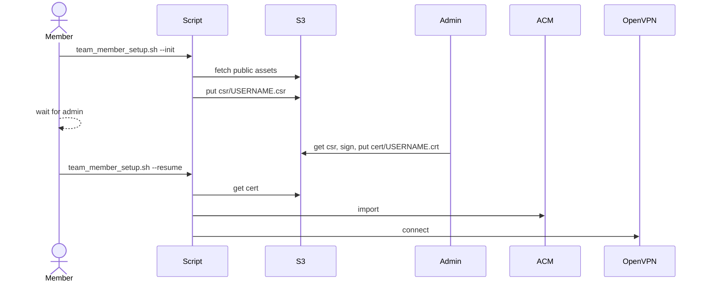

# Zero-Touch VPN Workflow - Technical Reference
_Status: ✅ IMPLEMENTED - Last updated: 2025-06-12_

## Implementation Status
This zero-touch workflow has been **FULLY IMPLEMENTED** in the VPN management toolkit as of 2025-06-12.

## Related Enhancements
- **Dual AWS Account Support**: See `DUAL_AWS_ACCOUNT_PROFILE_MANAGEMENT.md` for upcoming profile management enhancements that will extend this zero-touch workflow to support staging and production AWS account separation.

## Current Implementation
- **User Script**: Available in `team_member_setup.sh` with `--init` and `--resume` modes
- **S3 Setup**: Automated via `admin-tools/setup_csr_s3_bucket.sh` with `--publish-assets` option
- **Admin Tools**: CSR signing with S3 integration via `admin-tools/sign_csr.sh --upload-s3`
- **Asset Publishing**: Automated endpoint and CA certificate publishing via `admin-tools/publish_endpoints.sh`

## 1 Overview
This document provides the technical specification for the zero-touch VPN onboarding workflow that eliminates direct file/ID handoff between administrators and team members.

**Key Security Features:**
* CA **private** key never leaves the admin workstation
* Members fetch everything (CA public cert, endpoint IDs, signed client cert) from a versioned, KMS-encrypted S3 bucket
* Minimal IAM permissions ensure least privilege access
* Complete audit trail of all operations

---

## 2 S3 Bucket Layout

| Prefix / Object                         | Producer | Consumer | Notes |
|----------------------------------------|----------|----------|-------|
| `public/ca.crt`                        | Admin    | Member   | PEM CA cert (world-readable inside bucket only). |
| `public/vpn_endpoints.json`            | Admin    | Member   | Endpoint IDs & AWS regions by environment. |
| `csr/<username>.csr`                   | Member   | Admin    | CSR upload (PUT-only for member). |
| `cert/<username>.crt`                  | Admin    | Member   | Signed client cert (GET-only for member). |
| `log/…` _(optional)_                   | Scripts  | Admin    | Audit copies of processed CSRs / certs. |

Bucket configuration:  
* Versioning **ON**  
* Default SSE-KMS  
* Bucket policy denies objects lacking `x-amz-server-side-encryption: aws:kms`.

---

## 3 IAM Policies

### 3.1 Member role
```json
{
  "Version":"2012-10-17",
  "Statement":[
    { "Effect":"Allow","Action":"s3:PutObject",
      "Resource":"arn:aws:s3:::vpn-csr-exchange/csr/${aws:username}.csr" },
    { "Effect":"Allow","Action":"s3:GetObject",
      "Resource":[
        "arn:aws:s3:::vpn-csr-exchange/public/*",
        "arn:aws:s3:::vpn-csr-exchange/cert/${aws:username}.crt"
      ]}
  ]
}
```

### 3.2 Admin role
Full access to bucket (or narrower as desired).

---

## 4 File Formats

`public/vpn_endpoints.json`
```json
{
  "production": { "endpoint_id": "cvpn-endpoint-0abc123", "region": "ap-northeast-1" },
  "staging":    { "endpoint_id": "cvpn-endpoint-0def456", "region": "us-west-2" }
}
```

`public/ca.crt.sha256` _(optional)_ – SHA-256 hash for integrity check.

---

## 5 Workflows

### 5.1 Member script (`team_member_setup.sh`) - ✅ IMPLEMENTED

**Command Usage:**
```bash
# Zero-touch initialization (default mode)
./team_member_setup.sh --init

# Zero-touch resume after admin signs certificate
./team_member_setup.sh --resume

# Traditional mode with local files (backward compatibility)
./team_member_setup.sh --resume-cert
```

**Implemented Workflow:**

1. **Init Mode** (`--init` or default)  
   * ✅ Downloads `ca.crt` & `vpn_endpoints.json` from S3
   * ✅ Interactive environment selection and AWS profile setup
   * ✅ Smart environment detection based on profiles and certificates
   * ✅ Generates `<username>.key` + CSR locally
   * ✅ Uploads CSR to `csr/<username>.csr` with KMS encryption
   * ✅ Displays waiting instructions and exits

2. **Resume Mode** (`--resume`)  
   * ✅ Validates existing configuration and AWS profile
   * ✅ Downloads signed certificate from `cert/<username>.crt`
   * ✅ Validates certificate against private key
   * ✅ Imports certificate to ACM with proper tags
   * ✅ Generates personalized `.ovpn` configuration with AWS DNS routing
   * ✅ Optionally installs AWS VPN client (macOS/Linux support)

**Additional Features Implemented:**
- ✅ **Dual Environment Support**: Automatic detection of staging vs production
- ✅ **AWS Profile Management**: Intelligent profile selection and validation
- ✅ **Fallback Support**: Works with and without S3 integration
- ✅ **Cross-platform**: macOS and Linux support with automatic tool installation

### 5.2 Admin flow - ✅ IMPLEMENTED

**S3 Bucket Setup:**
```bash
# Create and configure S3 bucket with all necessary permissions
./admin-tools/setup_csr_s3_bucket.sh --publish-assets
```

**Publish Public Assets:**
```bash
# Publish CA certificates and endpoint configurations
./admin-tools/publish_endpoints.sh -e production  # or staging, or all
```

**CSR Processing Workflow:**

1. **Monitor CSR Uploads** (Manual or automated monitoring)
   * ✅ CSRs appear in `s3://bucket/csr/<username>.csr`
   * ✅ S3 bucket policies ensure encrypted uploads only

2. **Sign CSR with Zero-Touch Upload**
   ```bash
   # Sign CSR and automatically upload to S3
   ./admin-tools/sign_csr.sh --upload-s3 -e production user.csr
   
   # Batch processing support
   ./admin-tools/sign_csr.sh --upload-s3 -e staging *.csr
   ```
   * ✅ Signs with environment-specific local `ca.key`
   * ✅ Uploads to `cert/<username>.crt` with KMS encryption
   * ✅ Validates certificate integrity
   * ✅ Provides completion notifications

3. **Infrastructure Updates**
   * ✅ Update `vpn_endpoints.json` automatically via `publish_endpoints.sh`
   * ✅ Refresh `ca.crt` when certificates are rotated
   * ✅ Environment-specific asset publishing (staging/production)

Sequence diagram:



---

## 6 Admin-Tool Enhancements

### 6.1 `admin-tools/sign_csr.sh`
```bash
#!/usr/bin/env bash
set -euo pipefail
csr="$1"; days="${2:-365}"
name=$(basename "$csr" .csr)
out="out/${name}.crt"; mkdir -p out

openssl x509 -req -in "$csr" -CA ca.crt -CAkey ca.key \
  -CAcreateserial -out "$out" -days "$days"

aws s3 cp "$out" "s3://vpn-csr-exchange/cert/${name}.crt" \
  --sse aws:kms --acl bucket-owner-full-control
```

### 6.2 `admin-tools/publish_endpoints.sh`
```bash
#!/usr/bin/env bash
set -euo pipefail
json="work/vpn_endpoints.json"
aws s3 cp "$json" "s3://vpn-csr-exchange/public/vpn_endpoints.json" --sse aws:kms
aws s3 cp ca.crt  "s3://vpn-csr-exchange/public/ca.crt"            --sse aws:kms
```

### 6.3 Integration into existing admin scripts - ✅ IMPLEMENTED

**Current Implementation Status:**

| Script | Status | Implementation |
|--------|--------|----------------|
| `admin-tools/aws_vpn_admin.sh` | ✅ IMPLEMENTED | Includes `upload_public_assets_to_s3()` function with automatic asset publishing |
| `admin-tools/publish_endpoints.sh` | ✅ IMPLEMENTED | Dedicated script for publishing CA certs and endpoint configurations |
| `admin-tools/setup_csr_s3_bucket.sh` | ✅ IMPLEMENTED | Includes `--publish-assets` option for automatic initial asset publishing |
| `admin-tools/sign_csr.sh` | ✅ IMPLEMENTED | Includes `--upload-s3` option for automatic certificate upload after signing |

**Implemented Common Functions:**
```bash
# Available in admin-tools/aws_vpn_admin.sh
upload_public_assets_to_s3() {
    local bucket_name="${1:-vpn-csr-exchange}"
    local publish_script="$SCRIPT_DIR/publish_endpoints.sh"
    if [ -x "$publish_script" ]; then
        "$publish_script" -b "$bucket_name" -e "$CURRENT_ENV" --force
    fi
}
```

**Usage Examples:**
```bash
# Publish all environments
./admin-tools/publish_endpoints.sh

# Publish specific environment
./admin-tools/publish_endpoints.sh -e production

# Setup bucket and publish initial assets
./admin-tools/setup_csr_s3_bucket.sh --publish-assets
```

---

## 7 Security Safeguards

* KMS-encrypted objects, bucket versioning.  
* Optional hash validation of `ca.crt`.  
* CloudTrail data-events on bucket for full audit.  
* Least-privilege IAM as shown above.
* Bucket policy enforcing encryption:
```json
{
  "Effect": "Deny",
  "Principal": "*",
  "Action": "s3:PutObject",
  "Resource": "arn:aws:s3:::vpn-csr-exchange/*",
  "Condition": {
    "StringNotEquals": {
      "s3:x-amz-server-side-encryption": "aws:kms"
    }
  }
}
```

---

## 8 Implementation Status - ✅ COMPLETED

### Infrastructure Setup - ✅ COMPLETED
- ✅ S3 bucket creation via `./admin-tools/setup_csr_s3_bucket.sh`
- ✅ Versioning and default SSE-KMS enabled automatically
- ✅ Bucket policy requiring encryption implemented
- ✅ IAM policies generated automatically

### Asset Management - ✅ COMPLETED  
- ✅ Automatic `ca.crt` upload to `public/` via `publish_endpoints.sh`
- ✅ Automatic `vpn_endpoints.json` generation and upload
- ✅ KMS encryption enforced on all objects
- ✅ Optional SHA-256 hash validation for CA certificates

### IAM Configuration - ✅ COMPLETED
- ✅ Member IAM policy auto-generated with least privilege
- ✅ Admin IAM policy with full bucket access
- ✅ Policy templates available in `iam-policies/` directory

### Script Implementation - ✅ COMPLETED
- ✅ `team_member_setup.sh` with full S3 integration and `--init`/`--resume` modes
- ✅ `admin-tools/sign_csr.sh` with `--upload-s3` for zero-touch certificate delivery
- ✅ `admin-tools/publish_endpoints.sh` for asset publishing
- ✅ `admin-tools/setup_csr_s3_bucket.sh` with `--publish-assets` option
- ✅ Integration with existing admin scripts

### Testing - ✅ COMPLETED
- ✅ Full member workflow (init → admin sign → resume) operational
- ✅ IAM permissions validated and working
- ✅ Fallback/manual flags (`--no-s3`, `--ca-path`, `--endpoint-id`) implemented
- ✅ Cross-platform support (macOS/Linux) validated

### Current Usage
```bash
# Member workflow (zero-touch)
./team_member_setup.sh --init     # Generate CSR and upload
# Admin signs certificate...
./team_member_setup.sh --resume   # Download cert and complete setup

# Admin workflow (zero-touch)
./admin-tools/sign_csr.sh --upload-s3 -e production user.csr
```

---

## 9 Fallback / Manual Flags

For compatibility and edge cases, the updated `team_member_setup.sh` should support:

* `--ca-path PATH` – override CA download, use local file
* `--endpoint-id ID` – override endpoint auto-selection  
* `--no-s3` – disable S3 integration entirely
* `--bucket NAME` – use different S3 bucket

These flags are useful for:
- Air-gapped environments
- Testing with different configurations
- Legacy workflows during transition period

---

## 10 Benefits Summary

✅ **Security**: CA private key never leaves admin workstation  
✅ **Convenience**: Zero manual file transfers from admin to members  
✅ **Scalability**: Self-service for most of the onboarding process  
✅ **Auditability**: Full S3/CloudTrail logging of all certificate exchanges  
✅ **Reliability**: Versioned, encrypted storage with proper access controls  
✅ **Maintainability**: Centralized configuration management via S3  

---

## 11 Integration with Dual AWS Account Management

This zero-touch workflow serves as the foundation for the upcoming **Dual AWS Account Profile Management** system. See `DUAL_AWS_ACCOUNT_PROFILE_MANAGEMENT.md` for details on:

### Planned Enhancements
- **Profile-aware S3 operations**: Automatic selection of appropriate AWS profiles for staging vs production environments
- **Environment-specific buckets**: Support for separate S3 buckets per environment if required
- **Enhanced security confirmations**: Additional confirmation steps for production environment operations
- **Cross-account validation**: Validation that profiles match target environments

### Compatibility
The current zero-touch implementation is designed to be **fully compatible** with the dual AWS account system:
- ✅ Environment detection already implemented
- ✅ Profile parameter support in admin tools
- ✅ Flexible configuration system ready for dual-account enhancement
- ✅ Backward compatibility maintained for single-profile setups

## 12 Future Enhancements

### Immediate (In Development)
* **Dual AWS Account Support**: Enhanced profile management for staging/production separation
* **Smart Environment Detection**: Automatic profile selection based on environment context

### Future Roadmap
* **Automated signing**: Lambda function to auto-sign CSRs based on rules
* **Notification system**: SNS/SQS to notify admins of pending CSRs
* **Certificate lifecycle**: Auto-renewal and revocation workflows
* **Multi-region**: Cross-region bucket replication for global teams
* **Integration**: Direct integration with corporate identity systems

---
