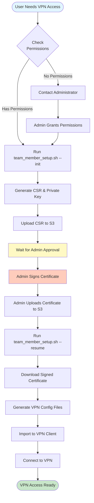

# VPN 使用者指南 - 工程團隊適用

本指南協助工程團隊成員設定並使用 AWS Client VPN 系統來安全存取公司資源。

## 🎯 本指南適用對象

- 軟體工程師
- QA 工程師
- DevOps 團隊成員
- 任何需要 VPN 存取 AWS 資源的人員

## 📊 VPN Setup Workflow



## 📋 系統需求

開始之前，請確認您具備：

### 硬體與軟體需求
- macOS 10.15+ (Catalina 或更新版本)
- 穩定的網路連線

### 存取權限需求
- **AWS IAM 使用者帳戶**：向您的主管或 IT 管理員申請
- **Slack 工作區存取權限**：確認可以存取 #vpn-endpoint-access 頻道
- **VPN 工具包**：向管理員取得 VPN 工具包專案的存取權限

### 需要安裝的軟體
- **AWS VPN Client** (推薦) 或 **OpenVPN Connect**
- 終端機 (macOS 內建的 Terminal.app)

> **不確定是否有權限？** 在 Slack #vpn-endpoint-access 頻道詢問管理員

## 🚀 初始設定（一次性）

### 步驟 1：取得 VPN 工具包

向管理員取得專案存取權限後，複製專案到本地：

```bash
# 複製專案（實際路徑請向管理員確認）
git clone <專案網址>
cd nlInc-vpnMgmtTools
```

### 步驟 2：檢查您的權限

```bash
./team_member_setup.sh --check-permissions
```

**預期結果：**
- ✅ 顯示綠色勾號表示權限正常
- ❌ 如果出現權限錯誤，請在 #vpn-endpoint-access 頻道聯繫管理員

### 步驟 3：選擇環境

在開始設定前，請確認您需要的環境：

| 環境 | 用途 | 適用情境 |
|------|------|----------|
| **staging** | 開發/測試環境 | 日常開發、功能測試、整合測試 |
| **production** | 正式環境 | 正式上線的服務、緊急修復、生產資料存取 |

> **建議**：一般開發工作使用 **staging** 環境即可。只有在需要存取正式資料或處理線上問題時才使用 production。

### 步驟 4：產生 VPN 憑證

```bash
# 初始化 VPN 設定（會互動式選擇 AWS profile 和環境）
./team_member_setup.sh --init

# 或直接執行（預設為 --init 模式）
./team_member_setup.sh
```

腳本執行時會：
1. **顯示互動式選單**讓您選擇要使用的 AWS profile
2. **自動判斷環境**（staging 或 production）基於 profile 名稱
3. **從 S3 下載 CA 憑證**
4. **產生您的私鑰**（留在本地，不會上傳）
5. **建立憑證簽署要求 (CSR)**
6. **上傳 CSR** 等待管理員批准

### 步驟 5：通知管理員並等待批准

腳本完成後，您將看到類似訊息：

```text
⏸️  設定暫停，等待管理員簽署您的憑證...
使用者名稱： john.doe
CSR 位置： s3://vpn-csr-exchange-xxx/csr/john.doe.csr
```

**請在 Slack #vpn-endpoint-access 頻道通知管理員：**

```text
@管理員 我的 VPN CSR 已準備好，請協助簽署。
使用者名稱：john.doe
環境：staging
```

等待管理員回覆確認憑證已簽署。

### 步驟 6：完成設定

收到管理員通知憑證已簽署後：

```bash
# 恢復設定並完成 VPN 配置
./team_member_setup.sh --resume
```

**預期結果：**
- 下載已簽署的憑證
- 產生 VPN 配置檔案 (`.ovpn`)
- 顯示配置檔案位置

```text
✅ VPN 設定完成！
📄 配置檔案位置：/path/to/your-username-staging.ovpn
```

---

## 📱 安裝 VPN 客戶端

### 選項 A：AWS VPN Client（推薦）

AWS 官方客戶端，穩定性佳。

1. **下載安裝程式**
   - 前往 [AWS VPN Client 下載頁面](https://aws.amazon.com/vpn/client-vpn-download/)
   - 選擇 macOS 版本下載

2. **安裝**
   - 開啟下載的 `.pkg` 檔案
   - 依照安裝精靈完成安裝
   - 安裝完成後，在 Applications 中找到 "AWS VPN Client"

### 選項 B：OpenVPN Connect

開源替代方案。

1. **下載安裝**
   - 從 [OpenVPN 官網](https://openvpn.net/client-connect-vpn-for-mac-os/) 下載
   - 或從 Mac App Store 搜尋 "OpenVPN Connect"

2. **安裝**
   - 開啟下載的安裝檔案
   - 依照指示完成安裝

---

## 🔌 日常 VPN 連線步驟

> ⚠️ **重要提醒**：每次使用 VPN 前，必須先透過 Slack 命令開啟 VPN 端點！

### 步驟 1：開啟 VPN 端點（必要）

在 Slack #vpn-endpoint-access 頻道輸入：

```text
/vpn open staging     # 開啟 staging 環境
/vpn open production  # 開啟 production 環境
```

⏱️ **等待時間**：命令執行可能需要 **5-10 分鐘**，因為 AWS 需要：
- 關聯 VPN 端點與子網路
- 配置網路路由
- 啟動 VPN 服務

**等待直到看到以下訊息：**

```text
🟢 VPN endpoint is now OPEN
Environment: staging
Status: available
You can now connect with your VPN client.
```

### 步驟 2：使用 VPN 客戶端連線

#### AWS VPN Client 連線步驟

1. **開啟 AWS VPN Client**
   - 從 Applications 資料夾開啟，或使用 Spotlight 搜尋

2. **匯入配置檔案**（首次使用）
   - 點擊 "File" → "Manage Profiles"
   - 點擊 "Add Profile"
   - 填寫 Display Name（例如：`Staging VPN`）
   - 點擊 "VPN Configuration File" 旁的瀏覽按鈕
   - 選擇您的 `.ovpn` 檔案（位置在步驟 6 完成時顯示）
   - 點擊 "Add Profile"

3. **連線**
   - 在主畫面選擇剛建立的 profile
   - 點擊 "Connect"
   - 等待狀態變成 "Connected"

4. **確認連線成功**
   - 狀態列顯示 "Connected"
   - 系統列出現 VPN 圖示

#### OpenVPN Connect 連線步驟

1. **開啟 OpenVPN Connect**

2. **匯入配置檔案**（首次使用）
   - 點擊 "+" 或 "Import Profile"
   - 選擇 "File" 標籤
   - 拖曳 `.ovpn` 檔案到視窗，或點擊 "Browse" 選擇檔案
   - 點擊 "Add"

3. **連線**
   - 點擊剛匯入的 profile 旁的連線按鈕
   - 等待狀態變成 "Connected"

### 步驟 3：驗證連線

連線後，請驗證 VPN 是否正常運作：

```bash
# 測試 DNS 解析（使用您環境中的內部主機名稱）
nslookup your-internal-service.internal

# 測試連線到內部服務（範例）
ping 10.0.0.x  # 替換為您的內部 IP

# 測試資料庫連線（範例）
mysql -h your-rds-endpoint.region.rds.amazonaws.com -u username -p
```

### 步驟 4：斷開連線

**使用 VPN 客戶端斷開：**
- AWS VPN Client：點擊 "Disconnect"
- OpenVPN Connect：點擊連線 profile 旁的斷開按鈕

**使用 Slack 關閉 VPN 端點（建議不使用時執行）：**

```text
/vpn close staging
```

> 💡 **節省成本**：VPN 端點開啟時會產生費用。不使用時請關閉端點。
> 系統會在靜置 100 分鐘（無實際流量）後自動斷線。

---

## 💻 Slack VPN 命令參考

在 #vpn-endpoint-access 頻道使用這些命令：

### 基本命令

| 命令 | 用途 | 範例 |
|------|------|------|
| `/vpn open [env]` | 開啟 VPN 端點 | `/vpn open staging` |
| `/vpn close [env]` | 關閉 VPN 端點 | `/vpn close staging` |
| `/vpn check [env]` | 檢查端點狀態 | `/vpn check production` |
| `/vpn help` | 顯示所有命令 | `/vpn help` |

### 排程管理命令 | Schedule Management Commands

VPN 系統具備自動排程功能，您可以透過以下命令管理：

| 命令 | 用途 | 範例 |
|------|------|------|
| `/vpn schedule on [env]` | 啟用自動排程 | `/vpn schedule on staging` |
| `/vpn schedule off [env]` | 停用自動排程 | `/vpn schedule off staging` |
| `/vpn schedule off [env] [duration]` | 暫時停用排程 | `/vpn schedule off staging 2h` |
| `/vpn schedule check [env]` | 檢查排程狀態 | `/vpn schedule check staging` |
| `/vpn schedule help` | 排程命令說明 | `/vpn schedule help` |

#### 細粒度排程控制 | Granular Schedule Control

| 命令 | 用途 |
|------|------|
| `/vpn schedule open on [env]` | 僅啟用自動開啟（平日 10:00） |
| `/vpn schedule open off [env]` | 僅停用自動開啟 |
| `/vpn schedule close on [env]` | 僅啟用自動關閉（閒置 100 分鐘） |
| `/vpn schedule close off [env]` | 僅停用自動關閉 |

#### 持續時間格式 | Duration Format

| 格式 | 說明 | 範例 |
|------|------|------|
| `Nh` | N 小時 | `2h`, `24h` |
| `Nd` | N 天 | `1d`, `7d` |

### 進階命令

| 命令 | 用途 | 範例 |
|------|------|------|
| `/vpn savings [env]` | 檢視成本節省統計 | `/vpn savings staging` |
| `/vpn costs daily` | 檢視每日成本 | `/vpn costs daily` |

### 環境名稱對照

| 完整名稱 | 可用別名 |
|----------|----------|
| `staging` | `stage`, `stg`, `dev` |
| `production` | `prod` |

---

## ⏰ 排程管理使用情境 | Schedule Management Scenarios

VPN 系統預設會在平日 10:00（台灣時間）自動開啟，並在閒置 100 分鐘後自動關閉。週末軟關閉（週五 20:00）會尊重活躍連線，若有使用者連線中會延遲 30 分鐘後再檢查。以下是常見的排程管理情境：

### 情境 1：長時間作業 | Long-Running Tasks

進行資料庫遷移或大量資料處理時，防止 VPN 被自動關閉：

```text
# 停用自動關閉 4 小時
/vpn schedule close off staging 4h

# 作業完成後，排程會自動恢復
# 或手動恢復：
/vpn schedule close on staging
```

### 情境 2：週末或假日 | Weekends or Holidays

假日期間不需要自動開啟 VPN：

```text
# 停用自動開啟 2 天
/vpn schedule open off staging 2d

# 假日結束後會自動恢復
```

### 情境 3：檢查目前排程狀態 | Check Current Status

不確定排程是否啟用時：

```text
/vpn schedule check staging
```

會顯示：
- 自動開啟狀態和下次排程時間
- 自動關閉狀態和閒置逾時設定
- 營業時間保護狀態
- 如果有停用，顯示剩餘時間

### 情境 4：完全停用自動排程 | Disable All Automation

特殊情況需要完全手動控制：

```text
# 停用所有自動排程
/vpn schedule off staging

# 需要時手動恢復
/vpn schedule on staging
```

> 💡 **提示**：建議使用帶有持續時間的命令（如 `2h`, `1d`），這樣排程會自動恢復，避免忘記重新啟用。

---

## 📁 檔案位置參考

```text
專案目錄/
├── certs/
│   ├── staging/              # Staging 憑證
│   │   └── users/
│   │       ├── ca.crt        # CA 憑證
│   │       ├── <username>.crt # 您的憑證
│   │       └── <username>.key # 您的私鑰 ⚠️ 請妥善保管！
│   └── production/           # Production 憑證
│       └── users/
│           └── ...
│
└── downloads/                 # VPN 配置檔案
    ├── <username>-staging.ovpn
    └── <username>-production.ovpn
```

---

## 🔧 疑難排解

### 常見問題與解決方案

#### ❌ "VPN endpoint is closed" 或無法連線

**原因**：VPN 端點尚未開啟

**解決方案**：
1. 在 Slack #vpn-endpoint-access 頻道執行：
   ```text
   /vpn open staging
   ```
2. 等待看到 "🟢 VPN endpoint is now OPEN" 訊息（約 5-10 分鐘）
3. 再使用 VPN 客戶端連線

#### ❌ "Connection timed out"

**可能原因與解決方案**：

1. **VPN 端點未開啟**
   - 執行 `/vpn check staging` 確認狀態
   - 如果顯示 closed，執行 `/vpn open staging`

2. **網路問題**
   - 確認您的網路連線正常
   - 嘗試切換網路（例如從 WiFi 切換到手機熱點）

3. **配置檔案過期**
   - 重新執行 `./team_member_setup.sh --resume` 更新配置

#### ❌ "Certificate expired" 或 "Certificate verification failed"

**解決方案**：重新申請憑證

```bash
# 重新執行初始化流程
./team_member_setup.sh --init

# 等待管理員簽署後，執行恢復
./team_member_setup.sh --resume
```

然後重新匯入新的 `.ovpn` 檔案到 VPN 客戶端。

#### ❌ "Access denied to specific service"

**原因**：您的安全群組權限可能不包含該服務

**解決方案**：在 #vpn-endpoint-access 聯繫管理員，說明您需要存取的服務。

#### ❌ VPN 已連線但無法存取內部服務

**排查步驟**：

1. 確認 VPN 客戶端顯示 "Connected"
2. 測試基本連線：
   ```bash
   # 檢查路由是否正確
   netstat -rn | grep utun

   # 測試 DNS
   nslookup internal-service.local
   ```
3. 如果 DNS 解析失敗，嘗試斷開重連
4. 仍有問題請聯繫管理員

### 取得協助

1. **Slack 支援**：在 #vpn-endpoint-access 頻道發問
2. **檢查狀態**：`/vpn check [environment]`
3. **聯絡管理員**：@提及 VPN 管理員

---

## 🔒 安全最佳實務

### 保護您的私鑰

- ❌ **絕不分享** `.key` 檔案給任何人
- ❌ **絕不上傳** 私鑰到任何雲端服務、Git 或通訊軟體
- ✅ 在安全位置保留本地備份
- ✅ 如有洩露疑慮，立即通知管理員

### VPN 使用規範

- ✅ 僅在需要存取內部資源時連線
- ✅ 完成工作後斷開連線
- ✅ 不使用時關閉 VPN 端點（`/vpn close`）
- ❌ 不要分享 VPN 配置檔案或存取權限

### 環境分離原則

- 🟡 **Staging**：用於開發、測試、實驗
- 🔴 **Production**：僅用於正式環境操作，需格外謹慎
- ⚠️ 在 production 環境操作前，請確認您的操作內容

---

## 📊 成本優化

系統自動管理成本：

- ⏱️ 在靜置 **100 分鐘**（無實際流量）後自動斷線
- 📊 追蹤使用情況和節省金額
- 💰 防止 24/7 VPN 費用累積

檢視成本統計：

```text
/vpn savings staging
/vpn costs daily
```

---

## 🆘 緊急程序

### 遺失私鑰或憑證外洩

1. **立即**在 #vpn-endpoint-access 通知管理員
2. 管理員會撤銷您的憑證
3. 重新執行設定流程產生新憑證

### 無法存取關鍵服務（緊急情況）

1. 確認 VPN 連線狀態
2. 執行 `/vpn check production` 確認端點狀態
3. 在 #vpn-endpoint-access 頻道緊急求助
4. 提供具體的錯誤訊息和您嘗試存取的服務

### 懷疑安全侵害

1. **立即斷開** VPN 連線
2. 通知安全團隊和管理員
3. 更改 AWS 憑據
4. 要求撤銷並重新產生憑證

---

## ⚡ 快速參考卡

```text
┌─────────────────────────────────────────────────────────┐
│                    VPN 使用快速參考                       │
├─────────────────────────────────────────────────────────┤
│  1️⃣  開啟端點    /vpn open staging                      │
│  2️⃣  等待訊息    🟢 VPN endpoint is now OPEN            │
│  3️⃣  客戶端連線  開啟 AWS VPN Client → Connect          │
│  4️⃣  完成工作後  客戶端 Disconnect → /vpn close staging │
├─────────────────────────────────────────────────────────┤
│  ⚠️  重要：必須先執行步驟 1-2，才能進行步驟 3            │
├─────────────────────────────────────────────────────────┤
│                    排程管理快速參考                       │
├─────────────────────────────────────────────────────────┤
│  📅 檢查排程    /vpn schedule check staging              │
│  ⏸️ 暫停 2 小時 /vpn schedule off staging 2h            │
│  ▶️ 恢復排程    /vpn schedule on staging                │
├─────────────────────────────────────────────────────────┤
│  🆘 遇到問題？在 #vpn-endpoint-access 頻道發問           │
└─────────────────────────────────────────────────────────┘
```

---

**需要管理員協助？** 在 Slack #vpn-endpoint-access 頻道發問或 @提及管理員
**需要技術細節？** 請參考 [架構文件](architecture.md)
