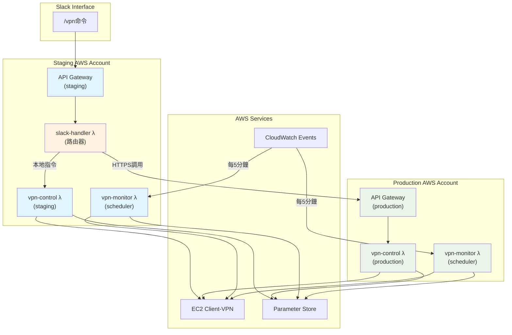
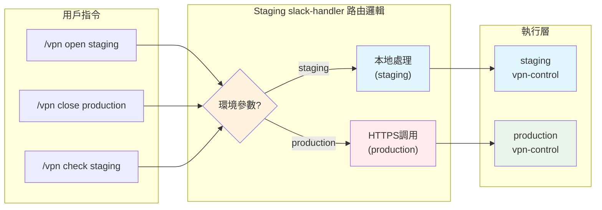
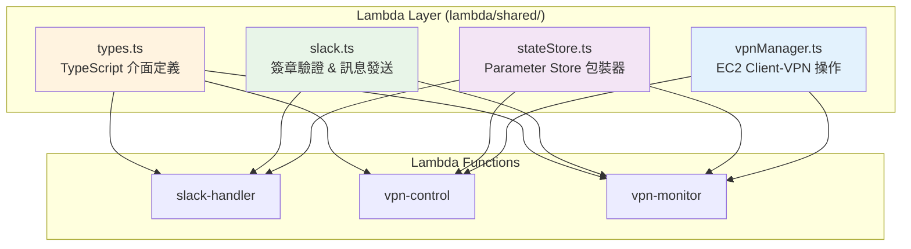
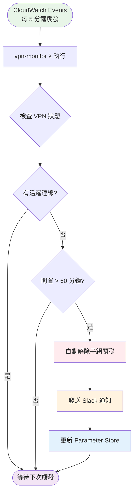

# VPN Cost-Saving Automation – **Implementation Guide**

*(Formerly `IMPLEMENTATION.md`; renamed with feature prefix.)*

## 1. Scope

This document explains **HOW** the cost-saving automation and Slack integration are implemented on top of the existing **Client-VPN dual-environment tool-chain**.  
It is aimed at engineers who will maintain or extend the solution.

```
Project root
├── docs/vpn_automation
│   ├── VPN_COST_AUTOMATION_IMPLEMENTATION.md   ← (this file)
│   ├── VPN_COST_AUTOMATION_DEPLOYMENT.md
│   └── VPN_COST_AUTOMATION_SLACK_SETUP.md
├── cdklib/                      ← CDK stacks (TS)
├── lambda/                      ← All Lambda source (TS)
│   ├── shared/                  ← Re-usable library layer
│   ├── slack-handler/           ← API Gateway entry
│   ├── vpn-control/             ← Core VPN ops
│   └── vpn-monitor/             ← Scheduler driven
└── scripts/                     ← Helper bash scripts
```

---

## 2. High-Level Architecture

### 2.1 總體架構圖



### 2.2 Slack 指令路由流程



### 2.3 Lambda Functions 架構詳細

| Lambda Function | 觸發方式 | 超時時間 | 主要功能 | IAM 權限需求 |
|-----------------|----------|----------|----------|--------------|
| **slack-handler** | API Gateway | 3 秒 | • 驗證 Slack 簽章 • 路由 `/vpn *` 指令 • 跨帳號 HTTPS 調用 | • `ssm:GetParameter` (讀取配置) |
| **vpn-control** | 直接調用 | 30 秒 | • `open`: 關聯子網到 VPN • `close`: 解除子網關聯 • `check`: 查詢 VPN 狀態 | • `ec2:*ClientVpn*` • `ssm:*Parameter*` |
| **vpn-monitor** | CloudWatch Events | 60 秒 | • 檢測閒置超過 60 分鐘 • **自動解除子網關聯** • 發送 Slack 通知 | • 同 vpn-control • `cloudwatch:PutMetricData` |

### 2.4 共享 Lambda Layer



### 2.5 自動監控與成本節省流程



### 2.6 關鍵優勢

- **🎯 單一 Slack App**：用戶體驗一致，無需記住不同指令
- **🏗️ 架構對稱**：兩個環境部署相同的 CDK stack，維護簡單
- **🔒 帳號隔離**：無需跨帳號 IAM 角色，安全性更高
- **⚡ 自動化監控**：智能檢測閒置並自動關閉，真正節省成本
- **🔧 運維友善**：標準 HTTPS 通訊，部署流程簡化

## 2.1 Multi-Account Slack Integration Challenge

**問題**: 當 staging 和 production 環境部署於不同 AWS 帳號時，但只有一個 Slack app，如何正確路由 Slack 指令？

**解決方案**: 建議採用以下架構之一：

### 單一指令路由器

```text
Slack App ─▶ 主要帳號 API Gateway ─▶ slack-handler (路由器)
                                     │ 
                                     ├── 本地 vpn-control (staging)
                                     │
                                     └── HTTPS 調用 ─▶ Production API Gateway ─▶ vpn-control
```

- **實作**:
  - Slack app 指向一個主要帳號（例如 staging）的 API Gateway
  - `slack-handler` 根據指令中的環境參數決定路由：
    - `/vpn open staging` → 本地呼叫 staging 的 vpn-control
    - `/vpn open production` → 透過 HTTPS 調用 production API Gateway
- **優點**:
  - 單一 Slack app，用戶體驗一致
  - 每個帳號獨立部署相同 CDK stack
  - 無需跨帳號 IAM 角色設定
  - 架構對稱，運維簡化

#### 實作範例

```ts
// staging 帳號的 slack-handler - 調用 production API Gateway
async function invokeProductionViaAPIGateway(command: string) {
  const productionAPIEndpoint = process.env.PRODUCTION_API_ENDPOINT;
  const apiKey = process.env.PRODUCTION_API_KEY;
  
  const response = await fetch(`${productionAPIEndpoint}/vpn`, {
    method: 'POST',
    headers: {
      'Content-Type': 'application/json',
      'x-api-key': apiKey,
    },
    body: JSON.stringify({
      command: command,
      requestId: generateRequestId(),
      sourceAccount: 'staging'
    })
  });
  
  if (!response.ok) {
    throw new Error(`Production API error: ${response.status}`);
  }
  
  return await response.json();
}
```

#### CDK 部署與跨帳號 URL 管理

```typescript
// 每個帳號部署相同的 VPN automation stack
export class VpnAutomationStack extends Stack {
  constructor(scope: Construct, id: string, props: StackProps) {
    super(scope, id, props);
    
    // 每個環境都有相同的架構
    const slackHandler = new Function(this, 'SlackHandler', { /* ... */ });
    const vpnControl = new Function(this, 'VpnControl', { /* ... */ });
    const apiGateway = new RestApi(this, 'VpnApi', { /* ... */ });
    
    // 環境變數差異僅在部署時注入
    slackHandler.addEnvironment('ENVIRONMENT', process.env.ENVIRONMENT!);
    
    // staging 需要 production API URL（部署時從環境變數讀取）
    if (process.env.ENVIRONMENT === 'staging') {
      if (!process.env.PRODUCTION_API_ENDPOINT) {
        throw new Error('PRODUCTION_API_ENDPOINT is required for staging deployment');
      }
      slackHandler.addEnvironment('PRODUCTION_API_ENDPOINT', process.env.PRODUCTION_API_ENDPOINT);
      slackHandler.addEnvironment('PRODUCTION_API_KEY', process.env.PRODUCTION_API_KEY || '');
    }
    
    // 輸出 API Gateway URL 供其他環境使用
    new CfnOutput(this, 'ApiGatewayUrl', {
      value: apiGateway.url,
      description: 'VPN Automation API Gateway URL',
    });
  }
}
```

#### 部署流程與腳本

**手動部署方式：**

```bash
# 1. 先部署 production
ENVIRONMENT=production cdk deploy --profile production-profile

# 2. 取得 production API Gateway URL
PRODUCTION_URL=$(aws cloudformation describe-stacks \
  --stack-name VpnAutomationStack \
  --query 'Stacks[0].Outputs[?OutputKey==`ApiGatewayUrl`].OutputValue' \
  --output text \
  --profile production-profile)

echo "Production API URL: $PRODUCTION_URL"

# 3. 部署 staging（傳入 production URL）
PRODUCTION_API_ENDPOINT="${PRODUCTION_URL}vpn" \
ENVIRONMENT=staging \
cdk deploy --profile staging-profile
```

**自動化部署腳本 `deploy.sh`：**

```bash
#!/bin/bash

set -e

if [ "$1" = "production" ]; then
    echo "🚀 Deploying production environment..."
    ENVIRONMENT=production cdk deploy --profile production-profile
    
    echo "✅ Production deployment completed!"
    echo "💡 To deploy staging, run: ./deploy.sh staging"
    
elif [ "$1" = "staging" ]; then
    echo "📡 Getting production API Gateway URL..."
    
    PRODUCTION_URL=$(aws cloudformation describe-stacks \
        --stack-name VpnAutomationStack \
        --query 'Stacks[0].Outputs[?OutputKey==`ApiGatewayUrl`].OutputValue' \
        --output text \
        --profile production-profile 2>/dev/null)
    
    if [ -z "$PRODUCTION_URL" ] || [ "$PRODUCTION_URL" = "None" ]; then
        echo "❌ Cannot get production API Gateway URL."
        echo "Please ensure production is deployed first: ./deploy.sh production"
        exit 1
    fi
    
    echo "✅ Found production URL: $PRODUCTION_URL"
    echo "🚀 Deploying staging environment..."
    
    PRODUCTION_API_ENDPOINT="${PRODUCTION_URL}vpn" \
    ENVIRONMENT=staging \
    cdk deploy --profile staging-profile
    
    echo "✅ Staging deployment completed!"
    echo "🔗 Staging will route production commands to: $PRODUCTION_URL"
    
elif [ "$1" = "both" ]; then
    echo "🚀 Deploying both environments..."
    ./deploy.sh production
    echo ""
    ./deploy.sh staging
    
else
    echo "VPN Automation Deployment Script"
    echo ""
    echo "Usage: $0 [production|staging|both]"
    echo ""
    echo "  production  Deploy production environment only"
    echo "  staging     Deploy staging environment (requires production to exist)"
    echo "  both        Deploy production first, then staging"
    echo ""
    echo "Examples:"
    echo "  $0 production     # First-time setup"
    echo "  $0 staging        # Deploy staging after production exists"
    echo "  $0 both           # Full deployment from scratch"
    exit 1
fi
```

#### 部署檢查清單

**首次設定（團隊 setup）：**
```bash
# 1. 完整部署兩個環境
./deploy.sh both

# 2. 驗證 staging 可以調用 production
# 在 Slack 中測試: /vpn check production
```

**日常更新：**
```bash
# 只更新 staging
./deploy.sh staging

# 只更新 production（staging 會自動使用新 URL）
./deploy.sh production

# production URL 變更後，需要重新部署 staging
./deploy.sh production
./deploy.sh staging
```

#### 關鍵優勢

1. **無跨帳號運行時權限**：staging Lambda 只從環境變數讀取 URL
2. **部署時解決依賴**：所有跨帳號讀取都在部署腳本中進行
3. **錯誤預防**：腳本會檢查必要條件，防止錯誤部署
4. **團隊友善**：新成員只需執行 `./deploy.sh both` 即可完成所有設定
5. **維護簡單**：無需管理額外的 Parameter Store 或跨帳號權限

#### Lambda 運行時實作

```typescript
// lambda/slack-handler/index.ts
export const handler = async (event: APIGatewayProxyEvent) => {
  const command = parseSlackCommand(event);
  
  if (command.environment === 'production' && process.env.ENVIRONMENT === 'staging') {
    // 從環境變數讀取 production URL（CDK 部署時設定）
    const productionUrl = process.env.PRODUCTION_API_ENDPOINT;
    
    if (!productionUrl) {
      throw new Error('Production API endpoint not configured');
    }
    
    // 發送 HTTPS 請求到 production
    return await invokeProductionViaAPIGateway(command, productionUrl);
  } else {
    // 本地處理
    return await invokeLocalVpnControl(command);
  }
};
```

---

## 3. Parameter Store Schema


| Key                                  | Type | Example Value                                   |
| ------------------------------------ | ---- | ----------------------------------------------- |
| `/vpn/endpoint/state`                 | String (JSON) | `{"associated":true,"lastActivity":"2025-06-13T14:03:22Z"}` |
| `/vpn/endpoint/conf`    | String (JSON)   | `{"ENDPOINT_ID":"cvpn-endpoint-0fee040f83981f12f","SUBNET_ID":"subnet-02bd062360a525a95"}`                                      |
| `/vpn/slack/webhook` *(encrypted)*   | SecureString   | Slack Incoming Webhook URL                      |

Reads are free (standard parameters).  
Writes use `PutParameter` with `overwrite=true`.

---

## 4. Lambda Package Layout (TypeScript)

```text
lambda/
├── shared/
│   ├── vpnManager.ts      ← EC2 logic (associate / disassociate / stats)
│   ├── stateStore.ts      ← ParameterStore wrapper
│   ├── slack.ts           ← verify signature, post message
│   └── types.ts           ← TypeScript interfaces for Parameter Store schema
├── slack-handler/index.ts
├── vpn-control/index.ts
└── vpn-monitor/index.ts
```

### 4.1 `types.ts` - Parameter Store Schema Types

```ts
// Matches /vpn/endpoint/state JSON structure
export interface VpnState {
  associated: boolean;
  lastActivity: string;  // ISO 8601 timestamp
}

// Matches /vpn/endpoint/conf JSON structure  
export interface VpnConfig {
  ENDPOINT_ID: string;   // e.g., "cvpn-endpoint-0fee040f83981f12f"
  SUBNET_ID: string;     // e.g., "subnet-02bd062360a525a95"
}

// Runtime status from EC2 API + Parameter Store
export interface VpnStatus {
  associated: boolean;
  activeConnections: number;
  lastActivity: Date;
}
```

### 4.2 `vpnManager.ts`

```ts
export async function associateSubnets(): Promise<void> { 
  // Read configuration from Parameter Store
  const config = await stateStore.readConfig();  // Gets /vpn/endpoint/conf
  
  // Associate subnet with VPN endpoint
  await ec2.associateClientVpnTargetNetwork({
    ClientVpnEndpointId: config.ENDPOINT_ID,
    SubnetId: config.SUBNET_ID
  }).promise();
  
  // Update state in Parameter Store
  await stateStore.writeState({ 
    associated: true, 
    lastActivity: new Date().toISOString() 
  });
}

export async function disassociateSubnets(): Promise<void> { 
  // Read configuration from Parameter Store
  const config = await stateStore.readConfig();  // Gets /vpn/endpoint/conf
  
  // Disassociate subnet from VPN endpoint
  await ec2.disassociateClientVpnTargetNetwork({
    ClientVpnEndpointId: config.ENDPOINT_ID,
    SubnetId: config.SUBNET_ID
  }).promise();
  
  // Update state in Parameter Store
  await stateStore.writeState({ 
    associated: false, 
    lastActivity: new Date().toISOString() 
  });
}

export async function fetchStatus(): Promise<VpnStatus> { 
  // Read current state and configuration
  const state = await stateStore.readState();    // Gets /vpn/endpoint/state
  const config = await stateStore.readConfig();  // Gets /vpn/endpoint/conf
  
  // Query EC2 for current connection status
  const connections = await ec2.describeClientVpnConnections({
    ClientVpnEndpointId: config.ENDPOINT_ID
  }).promise();
  
  return {
    associated: state.associated,
    activeConnections: connections.Connections?.length || 0,
    lastActivity: new Date(state.lastActivity)
  };
}
```

### 4.2.1 `stateStore.ts` - Parameter Store Integration

```ts
// Read VPN endpoint configuration
export async function readConfig(): Promise<VpnConfig> {
  const paramName = `/vpn/endpoint/conf`;
  const result = await ssm.getParameter({ Name: paramName }).promise();
  return JSON.parse(result.Parameter.Value);
}

// Read VPN state information  
export async function readState(): Promise<VpnState> {
  const paramName = `/vpn/endpoint/state`;
  const result = await ssm.getParameter({ Name: paramName }).promise();
  return JSON.parse(result.Parameter.Value);
}

// Write VPN state information
export async function writeState(state: VpnState): Promise<void> {
  const paramName = `/vpn/endpoint/state`;
  await ssm.putParameter({
    Name: paramName,
    Value: JSON.stringify(state),
    Type: 'String',
    Overwrite: true
  }).promise();
}

// Read Slack webhook URL (encrypted)
export async function readSlackWebhook(): Promise<string> {
  const paramName = `/vpn/slack/webhook`;
  const result = await ssm.getParameter({ 
    Name: paramName, 
    WithDecryption: true 
  }).promise();
  return result.Parameter.Value;
}
```

### 4.3 `vpn-monitor/index.ts` (idle logic)

```ts
const IDLE_MINUTES = Number(process.env.IDLE_MINUTES ?? 60);
const ENVIRONMENT = process.env.ENVIRONMENT;  // 'staging' or 'production'

export const handler = async (): Promise<void> => {
  try {
    // Fetch current VPN status using new Parameter Store schema
    const status = await vpnManager.fetchStatus();
    const state = await stateStore.readState();  // Gets /vpn/endpoint/state
    
    // Check if VPN is associated and has been idle
    if (state.associated && 
        status.activeConnections === 0 &&
        Date.now() - new Date(state.lastActivity).getTime() > IDLE_MINUTES * 60_000) {
      
      // Auto-disassociate subnets to save costs
      await vpnManager.disassociateSubnets();      // <─ key change
      
      // Update state in Parameter Store with new schema
      await stateStore.writeState({ 
        associated: false, 
        lastActivity: state.lastActivity  // Keep original lastActivity
      });
      
      // Send Slack notification
      await slack.notify(`#vpn-${ENVIRONMENT}`, 
        `⚠️ VPN ${ENVIRONMENT} idle >${IDLE_MINUTES} min. Subnets disassociated to save costs.`);
      
      // Increment CloudWatch metric
      await cloudwatch.putMetricData({
        Namespace: 'VPN/Automation',
        MetricData: [{
          MetricName: 'IdleSubnetDisassociations',
          Value: 1,
          Unit: 'Count',
          Dimensions: [{ Name: 'Environment', Value: ENVIRONMENT }]
        }]
      }).promise();
    }
  } catch (error) {
    console.error(`Error processing VPN monitor:`, error);
    await slack.notify(`#vpn-alerts`, 
      `🚨 VPN monitor error for ${ENVIRONMENT}: ${error.message}`);
  }
};
```

---

## 5. CDK Stacks (`cdklib/`)

The AWS CDK (Cloud Development Kit) is used to define and deploy all infrastructure for the VPN cost-saving automation. The main stack provisions Lambda functions, IAM roles, Parameter Store keys, environment variables, and monitoring resources. All stack code is located in the `cdklib/` directory (TypeScript).

### 5.1 Stack Overview

- **Lambda Functions**
  - `slack-handler` – API Gateway entry, Slack signature verification, command router
  - `vpn-control` – Handles open/close/status commands, manages VPN endpoint association
  - `vpn-monitor` – Scheduled (every 5 min), checks for idle, triggers auto-disassociation
  - Shared Lambda Layer (`lambda/shared/`) for utilities
- **Parameter Store (SSM)**
  - `/vpn/endpoint/state` – JSON state (associated, lastActivity)
  - `/vpn/endpoint/conf` – JSON config (ENDPOINT_ID, SUBNET_ID)
  - `/vpn/slack/webhook` – Slack webhook (SecureString)
- **IAM Roles**
  - Each Lambda gets a least-privilege role
  - `vpn-control`/`vpn-monitor`: `ec2:*ClientVpn*`, `ssm:*Parameter*`, `cloudwatch:PutMetricData`
  - `slack-handler`: `ssm:GetParameter`
- **Environment Variables**
  - `IDLE_MINUTES` – Idle timeout for auto-close
  - `ENVIRONMENT` – 'staging' or 'production' (set per deployment)
  - `SIGNING_SECRET_PARAM`, `WEBHOOK_PARAM`, `VPN_STATE_PREFIX`
- **Monitoring**
  - CloudWatch custom metrics: `IdleSubnetDisassociations`, Lambda duration, error count
  - CloudWatch dashboard JSON in `cdklib/monitoring/dashboard.json`
  - X-Ray tracing enabled for all Lambdas

### 5.2 Deployment Patterns

- **One stack per AWS account**: Staging 與 Production 部署於不同 AWS 帳號，各自有獨立的 CDK stack、Lambda、SSM 參數與資源。無需在同一帳號內多 stack。
- **所有變數與資源名稱皆依帳號環境分離**。
- **CI/CD**: 各帳號分別執行 `cdk deploy`，支援回滾。
- **Secrets**: Slack 簽章密鑰與 webhook 以 SecureString 儲存於各自帳號的 SSM。
- **跨帳號 Slack 整合**: 若採用方案 A（單一指令路由器），需在主要帳號（通常是 staging）部署完整的 slack-handler，並設定跨帳號 IAM 角色以調用其他帳號的 Lambda。

#### AWS Profile 感知部署

- 所有 CDK stack 與部署腳本必須支援 AWS profile 切換，建議：
  - 使用 `cdk deploy --profile <profile>` 明確指定目標帳號
  - 或設定環境變數 `AWS_PROFILE=<profile>` 再執行部署
- 管理與維運腳本（如 `admin-tools/aws_vpn_admin.sh`）皆會根據目前 profile 與環境自動切換，CDK 部署亦應一致
- 跨帳號部署時，請務必確認 profile 與 AWS CLI/SDK 指向正確帳號，避免資源誤佈署
- 建議將 profile 與環境對應關係記錄於 README 或部署文件，並於 CI/CD pipeline 明確指定

> 參考 `admin-tools` 目錄下腳本設計，所有自動化流程皆 profile-aware，CDK/部署腳本亦應遵循此原則。

> 部署時請確認 AWS CLI/SDK 已切換至正確帳號，避免資源誤佈署。

### 5.3 Example Resource Wiring

- **Lambda → SSM**: Lambdas read/write state/config via SSM Parameter Store
- **Lambda → EC2**: `vpn-control` and `vpn-monitor` call EC2 Client-VPN APIs
- **Lambda → CloudWatch**: All Lambdas emit metrics and logs
- **API Gateway → Lambda**: Slack commands routed to `slack-handler`

### 5.4 Stack Customization

- To change idle timeout, update `IDLE_MINUTES` in the stack definition
- To add new environments, duplicate the stack with a new `ENVIRONMENT` value
- To add new metrics or alarms, extend the CloudWatch dashboard and metric definitions

---

## 6. IAM Roles

- **slack-handler Lambda**: 只需 `ssm:GetParameter` 權限（讀 Slack secrets）與 CloudWatch Logs 權限。
- **vpn-control Lambda**: 需 `ec2:*ClientVpn*`、`ssm:*Parameter*`、`cloudwatch:PutMetricData`，以及 CloudWatch Logs 權限。
- **vpn-monitor Lambda**: 權限同 vpn-control。
- **最小權限原則**：所有 Lambda 角色僅允許存取 `/vpn/*` 前綴的 SSM 參數。
- **建議**：將 Lambda 執行角色與資源 ARN 綁定，避免過度授權。

## 7. Error Handling & Observability

- Lambda 內部所有 AWS 操作皆有 try/catch 包覆，錯誤會記錄於 CloudWatch Logs 並發送 Slack 警示。
- 重要自動化事件（如 idle auto-close）會發送 Slack 通知。
- 自訂 CloudWatch 指標：
  - `IdleSubnetDisassociations`：每次自動關閉時遞增
  - Lambda 執行錯誤數、p95 duration
- 建議設置 CloudWatch Alarm 監控 Lambda 錯誤率與自訂指標

## 8. Testing

### 8.1 Unit Tests (Jest)

- `vpnManager.test.ts`：mock EC2 SDK 驗證 associate/disassociate 邏輯
- `slack-handler.test.ts`：驗證 Slack 簽章與指令路由
- `vpn-monitor.test.ts`：模擬 idle 狀態與自動關閉

### 8.2 Integration Tests

| Scenario | Tool | Assertion |
|----------|------|-----------|
| Open VPN via Slack stub | curl to API Gateway with signed body | state.associated == true |
| Idle auto-close | step-function test harness | CloudWatch metric increment |

### 8.3 End-to-End Smoke

- `scripts/e2e/smoke.sh staging`：全流程驗證，2分鐘後檢查狀態

## 9. Configuration & Environment Variables

| Variable | Default | Used By | Description |
|----------|---------|---------|-------------|
| `IDLE_MINUTES` | `60` | vpn-monitor | Idle threshold before auto close |
| `SIGNING_SECRET_PARAM` | `/vpn/slack/signing_secret` | slack-handler | SSM path to HMAC secret |
| `WEBHOOK_PARAM` | `/vpn/slack/webhook` | shared/slack.ts | SSM path to Slack incoming webhook |
| `VPN_STATE_PREFIX` | `/vpn/` | shared/stateStore.ts | Prefix for Parameter Store keys |

所有變數皆於 `cdklib/stack.ts` 設定。

## 10. Local Development Workflow

```bash
npm i -g aws-cdk esbuild
cd lambda
npm ci
npm run watch     # esbuild --watch → dist/*
sam local invoke vpn-control -e events/open.json
```

- **esbuild**：TypeScript 快速打包
- **sam local** + `aws-vault` profile 可本地測試 Lambda
- `scripts/hot-reload.sh` 可同步變更至 dev stage

## 11. Monitoring & Observability

- CloudWatch 指標：
  - `IdleSubnetDisassociations`（自動關閉次數）
  - Lambda duration/error
- CloudWatch dashboard JSON 於 `cdklib/monitoring/dashboard.json`

---
